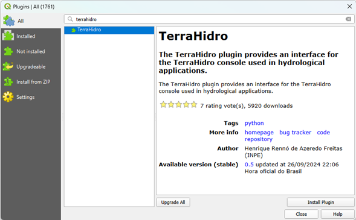
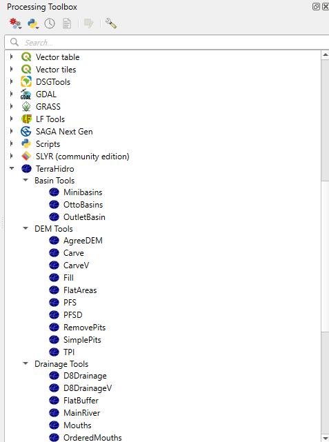

# Introduction

TerraHidro is an advanced geospatial analysis platform designed for hydrological and geomorphometric applications. Developed at the National Institute for Space Research (INPE), it provides a comprehensive suite of tools for digital elevation model (DEM) preprocessing, flow-direction modeling, watershed and stream network delineation, sink removal, floodplain mapping, and terrain analysis. Unlike traditional cartographic or visualization software, TerraHidro serves primarily as an analytical backend, seamlessly integrating with Geographic Information Systems (GIS) such as QGIS.

The system can be used in two main ways:

<li>QGIS Plugin: For users seeking a graphical workflow, TerraHidro integrates into the QGIS Processing Toolbox, providing intuitive interfaces to execute all functionalities directly within the GIS environment;</li>

<li>Command-Line Interface (CLI): TerraHidro operates as a stand-alone executable with no installation required. Users can run tools directly from a terminal or incorporate them into automated scripts for large-scale processing.</li>


TerraHidro supports raster data in the widely used, e.g. GeoTIFF format, and provides basic vector operations through ESRI Shapefiles.

By combining high-performance processing with open-source accessibility, TerraHidro enables researchers, students, and professionals to carry out hydrological modeling, geomorphological analysis, and environmental management with precision and reproducibility.

### Project Highlights {-}

<div class="prom-box prom-box-default shadow1" 
     style="background: #C7E2FF; color: #101010; font-size: 16px; line-height: 1.7;">
  <ul>
    <li>**Graph-based flow representation** that unifies local flow across digital elevation models;</li>
    <li>**Drainage extraction with pit handling** using methods such as Priority First Search (PFS) to remove spurious depressions and connect flow in flat areas;</li>
    <li>**Large-basin workflows**, with applications demonstrated for Amazon sub-basins;</li>
    <li>**Flexible integration** on TerraLib (C++), with bindings that enable coupling to other hydrological components;</li>
    <li>**Operational efficiency** from graph traversal and storage, supporting scalable accumulation and network operations;</li>
    <li>**Open architecture** that encourages extension and integration in broader GIS environments.</li>
  </ul>
</div>


## QGIS Plugin Installation and Setup {-}

The TerraHidro plugin for the QGIS Processing Toolbox provides users with interfaces that allow all TerraHidro functionalities to be executed directly inside QGIS. However, please note that simply installing the plugin does not guarantee its functionality. It is also necessary to configure an environment variable named `TERRAHIDRO` that points to the directory where the TerraHidro executable was extracted.


### Installing the TerraHidro Plugin in QGIS {-}

1. Open QGIS.  
2. Go to **Plugins > Manage and Install Plugins…**  
3. In the search box, type **"terrahidro"**.  
4. Select the **TerraHidro plugin** and click **Install Plugin**.  
5. Make sure to check the option **“Show experimental plugins”** under *Options* in the left menu.  




After installation, the TerraHidro plugin will appear in the **Processing Toolbox**.



---

### Configuring the `TERRAHIDRO` Environment Variable (Windows) {-}

In order for the plugin to work properly, you must configure the environment variable `TERRAHIDRO` to point to the directory where the TerraHidro executable (`th.exe`) is located. Follow these steps:

1. **Open the Control Panel**  
   - Press **Win + S** to open the search bar.  
   - Type **“Control Panel”** and press **Enter**.  

2. **Access Advanced System Settings**  
   - In the Control Panel, click **System and Security**.  
   - Click **System**.  
   - On the left panel, click **Advanced system settings**.  

3. **Open Environment Variables**  
   - In the *System Properties* window, go to the **Advanced** tab.  
   - Click the **Environment Variables…** button at the bottom.  

4. **Create a New User Variable**  
   - In the *User variables* section, click **New**.  

5. **Configure the Variable**  
   - In the **Variable name** field, type: `TERRAHIDRO`  
   - In the **Variable value** field, type the full path to the directory where the TerraHidro executable is located.  
     - Example: `C:\Users\<username>\Documents\PROGRAMS\TerraHidro-5.2.0`  

6. **Save and Close**  
   - Click **OK** to save the new variable.  
   - Click **OK** again to close the *System Properties* window.  

---

### Final Step {-}

The `TERRAHIDRO` environment variable is now configured in your user account, pointing to the directory of the TerraHidro executable. This allows the system to locate and execute TerraHidro from any location in the command prompt or within scripts.  

> **Important:** Restart any open applications or command prompts so that they recognize the newly created environment variable.

## Command-Line Interface {-}

TerraHidro can be used directly from the command line, making it a flexible and efficient option for processing terrain and hydrological data. The software is distributed as a stand-alone executable, so no installation is required—just extract the files and call the program from your terminal or command prompt.

Before running any operation, it is important to specify the directory where the TerraHidro executable is located. For example:


We recommend placing both the input and output files in the same directory as the TerraHidro executable. This avoids path errors and ensures that the program can easily locate the required files.

The structure of TerraHidro commands is designed to be simple and intuitive. Most tools follow the general pattern:


- **`th`** calls the TerraHidro executable.  
- **`<operation>`** specifies the tool to be executed (for example, `d8`, `removepits`, `pfs`, `minibasins`).  
- **`input.tif`** is the input raster file, usually a Digital Elevation Model (DEM).  
- **`output.tif`** is the resulting raster file generated by the operation.  

For example, to remove pits from a DEM, the command would be:


This straightforward structure makes TerraHidro easy to use while still offering powerful capabilities. By storing all files in the same directory and executing commands step by step, users can build reproducible workflows for DEM preprocessing, flow-direction modeling, watershed delineation, and hydrological hazard simulations.

### Example: Removing Pits with the `pfs` Operation {-}

The following example demonstrates how to use TerraHidro from the command line:
```bash
C:\data>th pfs inputDEM.tif outputDEM.tif
```

- **`C:\data>`** indicates the working directory where both the TerraHidro executable (`th.exe`) and the raster files are stored.  
- **`th`** calls the TerraHidro program.  
- **`pfs`** specifies the operation to be executed. The *Priority-Flood Search (PFS)* algorithm is applied to remove sinks or depressions (pits) from a Digital Elevation Model (DEM), generating a hydrologically consistent surface.  
- **`inputDEM.tif`** is the input raster file containing the original DEM.  
- **`outputDEM.tif`** is the output raster file that will be created, representing the pitless DEM.  

This simple command ensures that the DEM is corrected for spurious depressions, which is a fundamental preprocessing step before calculating flow directions, contributing areas, and drainage networks.

> 💡 **Tip – Changing the Working Directory**
>
> Before running TerraHidro commands, make sure you are in the directory where the executable (`th.exe`) and your input/output files are located.  
>
> On **Windows**, use the `cd` command:
> ```
> cd C:\Users\<username>\Documents\PROGRAMS\TerraHidro-5.2.0
> ```
>
> On **Linux/MacOS**, use:
> ```
> cd /home/<username>/PROGRAMS/TerraHidro-5.2.0
> ```
>
> After changing to the correct directory, you can call TerraHidro tools directly, for example:
> ```
> th pfs inputDEM.tif outputDEM.tif
> ```

