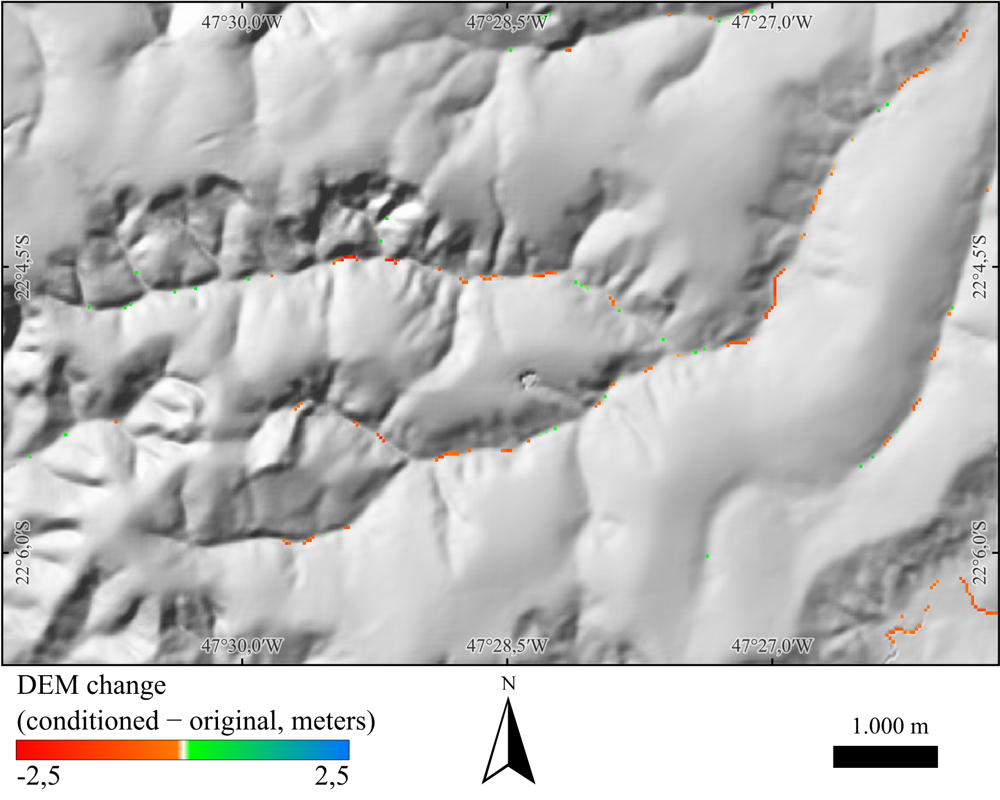
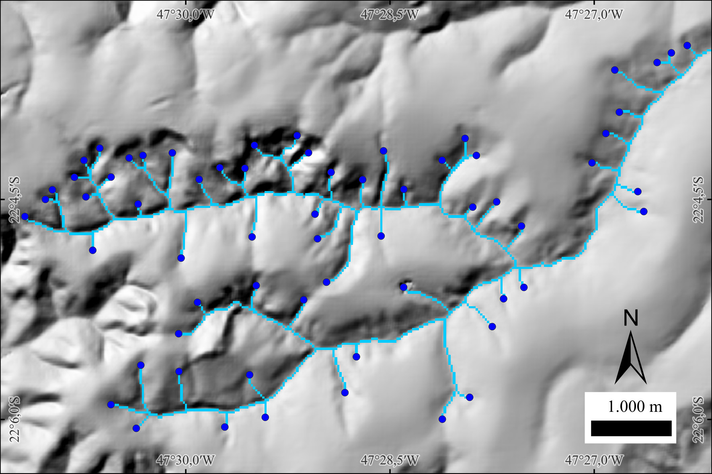
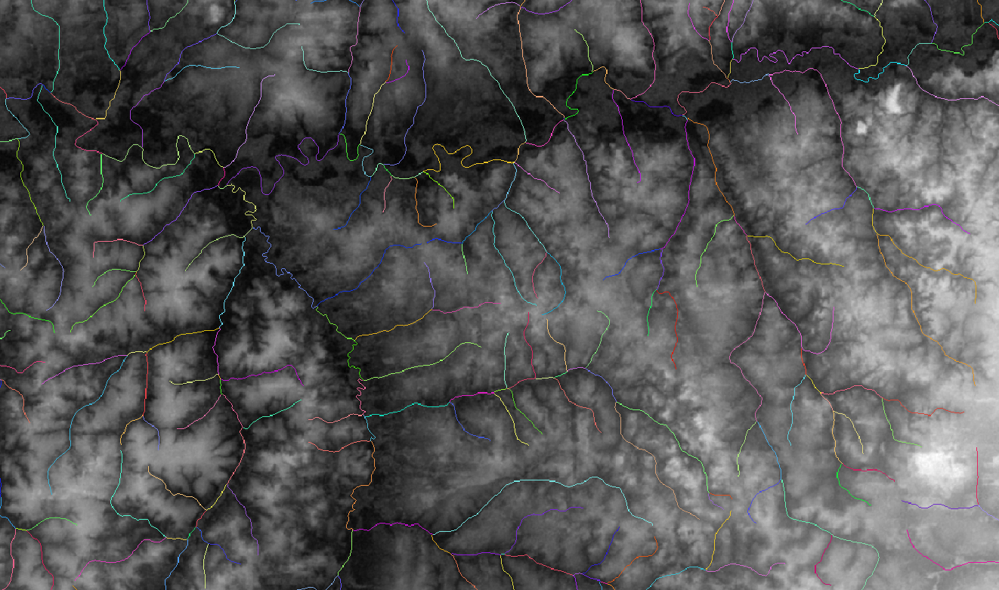
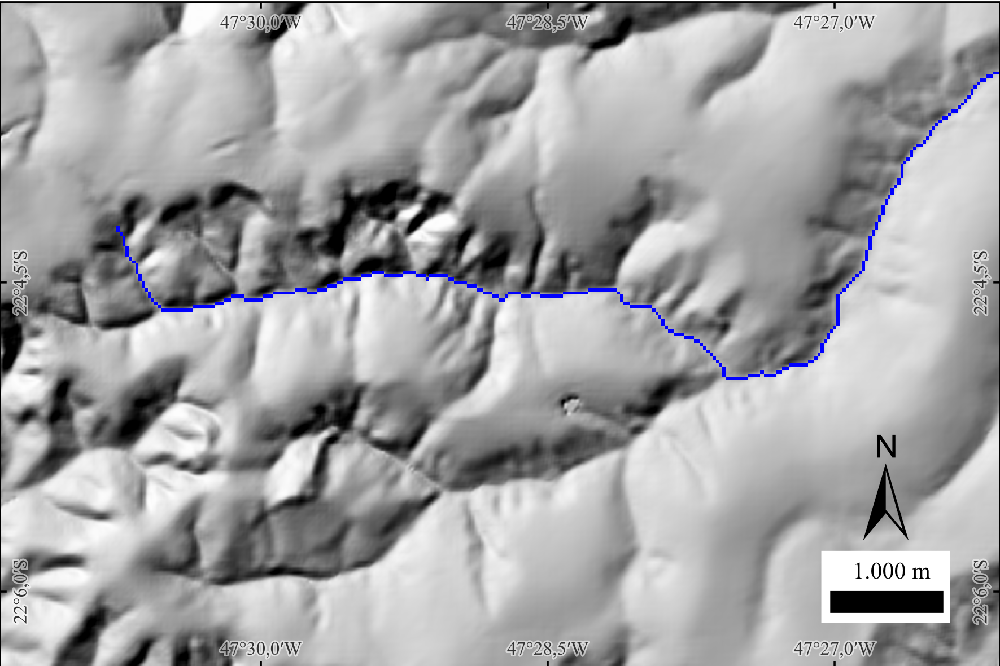

---
output:
  html_document: default
  pdf_document: default
---

# Hydrological Analysis {#hydrological-analysis}

## DEM Pre-processing and Correction {#DEM-Pre-processing-and-Correction}

This group of algorithms is designed to transform a raw Digital Elevation Model (DEM) into a hydrologically correct surface where water can flow uninterrupted to the watershed outlet. It addresses common DEM errors like pits (depressions), flat areas, and misalignments with known river networks. The output is a "pitless" and "conditioned" DEM that is essential for accurate flow direction, watershed delineation, and subsequent hydrological analysis.

- [simplepits](#simplepits)
- [agreedem](#agreedem)
- [flatareas](#flatareas)
- [carvev](#carvev)
- [carve](#carve)
- [fill](#fill)
- [pfs](#pfs)
- [pfsd](#pfsd)
- [removepits](#removepits)


### simplepits {#simplepits}

`simplepits` is an initial, targeted step for removing hydrological depressions (pits) from a Digital Elevation Model (DEM) while keeping changes to the terrain as small as possible. In pit removal there are three general strategies—fill, carve/breach, or hybrid. Filling is the simplest, but applying it indiscriminately can trigger a cascade: fixing one pit creates new pits in neighboring cells, which leads to further fills and can produce artificial flat areas that were not present in the original DEM. To avoid this, `simplepits` focuses only on simple pits — those that can be eliminated by a single, localized elevation increase without causing any neighboring cell to become a new pit. The algorithm proceeds with a controlled trial-and-error step: it tentatively raises the pit cell by a small amount, checks the surrounding cells, and accepts the change only if no new pits appear. If any adjacent cell becomes a pit, the change is reverted and that cell is labeled a complex pit to be handled later. Operationally, it runs in linear time with respect to the number of pit cells and is intended as a conservative first pass before more comprehensive conditioning.

In TerraHidro there are two functionalities for pit removal: `simplepits` and [`pfs`](#pfs). The `simplepits` functionality modifies only the pit cell. A new elevation is assigned to that cell based on the lowest neighboring elevation plus a predefined increment (in practice, `1e-3`). After this increment is applied, all neighboring cells** of the pit must be checked to ensure that no new pits were created. If none of the neighbors becomes a pit, the original pit is considered resolved by a simple, local operation and is classified as a simple pit. If any neighbor becomes a pit, the modification is undone and that pit cell is deferred to `pfs`, which handles complex pits. 


**Figure - Simple pit resolution (a–b).** (a) Initial DEM with pit cell C2 (orange) and D8 flow directions (blue). (b) C2 is raised to the lowest neighboring cell (D3) by a small increment, eliminating the pit without creating adjacent pits; the edit is accepted as a simple-pit case. Source: Jardim (2017).

| Flag        | Description               |
|-------------|---------------------------|
| `dem` | Input raster DEM file *(e.g.,inputDEM.tif)*    |
| `output` | Output raster file *(e.g., `outputDEM.tif`)*  |

The following example demonstrates how to use `simplepits` tool from the command line:
```bash
th simplepits inputDEM.tif outputDEM.tif
```


*Reference*:

Jardim, A. C. (2017). *Direções de fluxo em modelos digitais de elevação: um método com foco na qualidade da estimativa e processamento de grande volume de dados* [Doctoral dissertation, Instituto Nacional de Pesquisas Espaciais (INPE)]. [https://sid.inpe.br/mtc-m21b/2017/05.17.13.26](http://mtc-m21b.sid.inpe.br/col/sid.inpe.br/mtc-m21b/2017/05.17.13.26/doc/publicacao.pdf?metadatarepository=sid.inpe.br/mtc-m21b/2017/05.17.13.26.57&mirror=sid.inpe.br/mtc-m21b/2013/09.26.14.25.22&languagebutton=en)

*See also*: [pfs](#pfs), [removepits](#removepits).


### agreedem {#agreedem}

`agreedem` modifies a Digital Elevation Model (DEM) in and around a known drainage network to improve the agreement between automatically derived flow directions and observed/reference channels. When the drainage extracted from a raw DEM does not align with mapped streams, `agreedem` “guides” flow by sharpening (trenching/burning) the elevations along the reference network and optionally smoothing the surrounding cells within a distance buffer. This targeted editing is especially effective over low-relief and flat areas, where automatic drainage extraction is most ambiguous and computationally costly (see Clarke & Burnett, 2003).

`agreedem` is **not** a complete pit/flat conditioning method on its own. It only edits elevations on the reference lines and nearby cells; therefore, a hydrologically conditioned DEM (HC-DEM) still requires flat-area handling** and **pit removal** (e.g., `simplepits` then `pfs`) so that D8 flow directions are defined everywhere. In practice, drainage data are supplied as vector lines and first converted to a raster grid; each stream cell receives an assigned “burn” value (stream burning; Wang et al., 2011), producing a gridded drainage mask that `agreedem` uses together with the original DEM.

The reconditioning occurs in two coupled steps:

- **Sharpening (trenching/burning):** a fixed decrement is subtracted from the elevation of every drainage cell to carve a narrow channel along the reference lines. This intentionally introduces artificial micro-valleys that act as **flow guides** for automatic extraction.
- **Smoothing (buffered taper):** within a user-defined buffer radius (in cells) around the drainage, additional decrements are applied that decrease with distance from the line (distance-weighted). This creates a small stepped cross-section that transitions the trench back to the surrounding terrain, reducing artifacts and improving convergence of flow to the channel.


**Figure 3.1. Reconditioning (AgreeDEM).** Cross-section example showing a 3×3 buffer where the nearest ring to the channel receives the largest decrement, the next ring a smaller decrement, and so on; the drainage cells themselves receive a larger **burn** depth. (Illustrative values follow the narrative.)

> **Workflow note.** After running `agreedem`, proceed with **flat-area** and **pit** resolution (e.g., `flatareas` → `simplepits` → `pfs`) to obtain a final HC-DEM suitable for D8 flow direction, contributing area, and watershed delineation.

---

**Parameters**

| Flag              | Description                                                                                                                                                                                        |
|-------------------|----------------------------------------------------------------------------------------------------------------------------------------------------------------------------------------------------|
| `dem`       | Input DEM raster file (GeoTIFF) (e.g., *inputDEM.tif*).                                                                                                                                            |
| `drainage`      | Input drainage network (vector `.shp` or raster grid). Vector lines are rasterized internally/externally to a grid for stream burning (e.g., *inputDrainage.shp*).                                   |
| `burn`          | Trench depth applied to drainage cells (fixed decrement), e.g., `50`.                                                                                                                              |
| `buffer`        | Buffer radius in cells around drainage for smoothing (distance-weighted taper), e.g., `3`.                                                                                                     |
| `smooth`        | Smoothing factor that scales decrements within the buffer (larger values yield stronger taper near the channel), e.g., `10`.                                                                       |
| `burn-only`     | Optional switch to disable smoothing and apply trenching only on drainage cells.                                                                                                               |
| `output`    | Output reconditioned DEM (GeoTIFF) (e.g., *outputDEM.tif*).                                                                                                                                        |

The following example demonstrates how to use `agreedem` tool from the command line:
```bash
th agreedem inputDEM.tif inputDrainage.shp BURN BUFFER SMOOTH outputDEM.tif
```
Example (illustrative):
```bash
th agreedem inputDEM.tif inputDrainage.shp 20 3 10 outputDEM.tif
```

*Reference*:

Clarke, S., & Burnett, K. (2003). Comparison of digital elevation models for aquatic data development. Photogrammetric Engineering & Remote Sensing, 69(12), 1367-1375. [https://doi.org/10.14358/PERS.69.12.1367](https://doi.org/10.14358/PERS.69.12.1367)

Wang, J., Li, L., Hao, Z., & Gourley, J. J. (2011). Stream guiding algorithm for deriving flow direction from DEM and location of main streams. IAHS-AISH Publication, 346, 198-205.

*See also*: [pfsd](#pfsd).


### flatareas  {#flatareas}

*flatareas* identifies contiguous regions of uniform elevation within a Digital Elevation Model (DEM). The tool scans the input raster for adjacent cells possessing identical elevation values. It then groups these cells into distinct flat features.

The algorithm requires a user-defined minimum area threshold, specified as a number of cells. This parameter excludes smaller, potentially insignificant flat zones from the output. The result is a raster layer where each flat area is classified, providing a basis for subsequent hydrological conditioning procedures.

`flatareas` identifies flat areas—contiguous clusters of cells with the same elevation—and outputs a raster mask to be used in the next step (carving) so that flow lines can pass through the center of wide rivers and large flats. Flat areas are common in DEMs such as SRTM, AW3D30,  and Copernicus DEM where river widths exceed grid resolution; they often appear as a “staircase” along the longitudinal profile, and every cell within a flat behaves like a pit, increasing the cost of hydrologic conditioning. By first mapping these flats, subsequent processing can dig a V-shaped channel from the edges toward the center, reducing the number of pits and guiding drainage.

The original detection approach uses a simple image filter rather than an expensive region-growing segmentation. The filter has two parts: an inner 3×3 square (central test) and an outer cross (expansion). The kernel is swept from the upper-left to the lower-right of the DEM. At each position, if all cells in the inner square share the central cell’s elevation, then any cells in the outer cross that also match are marked as flat. Cells with invalid/NoData elevation (e.g., ocean mask values such as `-32768`) are ignored. This produces large connected flat patches efficiently. In Figure below (Identifying flat areas), intermediate steps (e.g., 26a and 26b) show the inner test and subsequent marking; by the final pass (step 112) most flat cells are identified. A few unmarked cells may remain, but they do not affect the next stage, which carves these flats.

An enhanced variant uses a breadth-first flood fill (8-connected: orthogonal and diagonal neighbors), starting from each valid cell, to visit all equal-elevation neighbors exactly once. This ensures complete detection with \(O(n)\) complexity (each DEM cell is processed once) and naturally selects diagonal borders as well as orthogonal ones. After each component is discovered, it is retained as a flat area only if it meets the minimum size (cell count) specified by the user.


**Figure 3.2. Identifying flat areas.** DEM cells with distinct elevations (brown) surround a flat river reach (white); gray cells are invalid/NoData (e.g., ocean/border). The 3×3 inner square (red) and outer cross (green) filter identify and mark the flat region (orange). By step 112, nearly all flat cells are tagged; any remaining unmarked cells are corrected during the subsequent carving stage. Source: Jardim (2017).

---

**Parameters**

| Flag            | Description                                                                                                  |
|-----------------|--------------------------------------------------------------------------------------------------------------|
| `dem`     | Input DEM raster (GeoTIFF), e.g., `inputDEM.tif`.                                                            |
| `min-cells`   | Positive integer for the minimum contiguous cell count required to classify a region as a flat area.     |
| `output`  | Output flat-areas mask (GeoTIFF), e.g., `outputFlatAreas.tif` (e.g., 1 = flat, 0 = non-flat).           |

The following example demonstrates how to use `flatareas` tool from the command line:
```bash
th flatareas inputDEM.tif MINCELLS outputFlatAreas.tif
```
Example:
```bash
th flatareas inputDEM.tif 25 outputFlatAreas.tif
```
*Reference*:

Jardim, A. C. (2017). *Direções de fluxo em modelos digitais de elevação: um método com foco na qualidade da estimativa e processamento de grande volume de dados* [Doctoral dissertation, Instituto Nacional de Pesquisas Espaciais (INPE)]. [https://sid.inpe.br/mtc-m21b/2017/05.17.13.26](http://mtc-m21b.sid.inpe.br/col/sid.inpe.br/mtc-m21b/2017/05.17.13.26/doc/publicacao.pdf?metadatarepository=sid.inpe.br/mtc-m21b/2017/05.17.13.26.57&mirror=sid.inpe.br/mtc-m21b/2013/09.26.14.25.22&languagebutton=en)

*See also*: [carvev](#carvev), [carve](#carve).

### carvev  {#carvev}

`carvev` detects flat areas in a DEM and carves them from the borders toward the center to form a V-shaped cross-section, guiding drainage through the midline of wide rivers and extensive flats. Unlike workflows that first require an explicit flat-area mask, `carvev` identifies flats internally and then performs the carving step; you do not need to run `flatareas` beforehand.

The algorithm first locates the orthogonal border of each flat (only horizontal/vertical adjacencies are considered borders; neighbors marked as invalid/NoData—e.g., ocean or DEM edges—are not treated as borders). It then decrements the elevation of all border cells by a small initial step and removes those cells from the flat set. The process repeats in rounds, each time re-identifying the new orthogonal border and applying decrements, progressively moving inward until no flat cells remain. This produces a stepped V profile: higher steps at the outer edges, lower steps toward the center, so that subsequent flow-direction and contributing-area calculations follow the centerline of the river/plain rather than hugging one bank. Special handling avoids carving from ocean/border toward the interior, preventing unrealistic flow from sea to land.

This pre-processing drastically reduces the number of pits in flats and accelerates downstream conditioning: after `carvev`, only a smaller set of residual depressions typically remains for `simplepits` and `pfs`, improving both robustness and performance.


**Figure - Demonstration of V-shaped carving of flat areas**. (a) Identify flats and their **orthogonal borders**; (b–e) iteratively decrement border elevations and move inward, forming a stepped V profile centered on the flat’s midline.

---

**Parameters**

| Flag           | Description                                                                                   |
|----------------|-----------------------------------------------------------------------------------------------|
| `dem`    | Input DEM raster (GeoTIFF), e.g., *(e.g.,inputDEM.tif)*.                                             |
| `output` | Output DEM (GeoTIFF) with flat areas carved in V-shape *(e.g., `outputDEM.tif`)*.                |

The following example demonstrates how to use `carvev` tool from the command line:
```bash
th carvev inputDEM.tif outputDEM.tif
```
*Reference*:

Jardim, A. C. (2017). *Direções de fluxo em modelos digitais de elevação: um método com foco na qualidade da estimativa e processamento de grande volume de dados* [Doctoral dissertation, Instituto Nacional de Pesquisas Espaciais (INPE)]. [https://sid.inpe.br/mtc-m21b/2017/05.17.13.26](http://mtc-m21b.sid.inpe.br/col/sid.inpe.br/mtc-m21b/2017/05.17.13.26/doc/publicacao.pdf?metadatarepository=sid.inpe.br/mtc-m21b/2017/05.17.13.26.57&mirror=sid.inpe.br/mtc-m21b/2013/09.26.14.25.22&languagebutton=en)

*See also*: [flatareas](#flatareas), [carve](#carve).


### carve  {#carve}

`carve` removes flat areas from a DEM by carving a gentle slope inside the flat mask produced by `flatareas`, optionally guided by a reference drainage network (vector or raster). In contrast to `carvev` (which converges toward the geometric center of the flat), `carve` can force the lowest elevations to align with mapped channels, producing flow paths that better match observed hydrography.

> **Workflow requirement.** Run `flatareas` first to generate the flat-area raster; pass this raster to `carve` together with the original DEM and the reference drainage network (if used).

**How it works (summary).**  
1) From the input flat-area mask, `carve` selects the border cells of each flat region according to a user-chosen neighborhood (orthogonal, diagonal, or all directions).  
2) If a reference drainage is enabled, cells on the drainage within the flat are treated as the lowest targets, so the carving preferentially guides slopes toward the mapped channel.  
3) The algorithm iteratively decrements border elevations and re-identifies new borders, moving inward like a stepped V-profile until the flat is removed. If drainage is not used, the carving converges toward the center (behavior similar to `carvev`).  
4) Any remaining uncarved flat cells at the end are adjusted with the last decrement step; if drainage is active, stream cells receive the smallest (lowest) elevation to ensure convergence to the channel.


**Figure - Comparison of the final stage between `carvev` and `carve`**. (a) original V-shaped notch (`carvev`, centered), (b) improved notch (`carve`, aligned with the reference drainage), the green pixels correspond to a reference drainage.  


---

**Parameters**

| Flag       | Description                                                                                                                                                                                                                         |
|---------------------|-------------------------------------------------------------------------------------------------------------------------------------------------------------------------------------------------------------------------------------|
| `dem`         | Input DEM (GeoTIFF) (e.g., *inputDEM.tif*).                                                                                                                                                                                          |
| `drainage`        | Input reference drainage (vector `.shp` or raster). When enabled (`DRNON`), carving aligns the lowest elevations with the drainage inside each flat. If disabled (`DRNOFF`), carving converges toward the center (like `carvev`). |
| `--flat`            | Input flat-areas raster (GeoTIFF) produced by `flatareas` (e.g., *inputFlatAreas.tif*). **Required.**                                                                                                                           |
| `DRNON | DRNOFF`    | Use drainage? `DRNON` = use drainage to guide carving; `DRNOFF` = do not use drainage (center-focused carving).                                                                                                             |
| `CROSS | DIAG | ALL`| Border-definition rule for each iteration: `CROSS` = orthogonal neighbors; `DIAG` = diagonal neighbors; `ALL` = eight-direction neighbors.                                                                                          |
| `output`      | Output DEM (GeoTIFF) with flat areas carved (e.g., *outputDEM.tif*).                                                                                                                                                                 |

The following example demonstrates how to use `carve` tool from the command line:
```bash
th carve inputDEM.tif inputDrainage.shp inputFlatAreas.tif DRNON|DRNOFF CROSS|DIAG|ALL outputDEM.tif
```

Example (illustrative):
```bash
th carve inputDEM.tif inputDrainage.shp FlatAreas.tif DRNON ALL outputDEM.tif
```

**Author**: Dr. Henrique Rennó de Azeredo Freitas

*See also*: [flatareas](#flatareas), [carvev](#carvev).


### fill  {#fill}

`fill` repairs missing-data holes (voids/NoData) in a DEM by fusing it with a reference DEM that provides elevation inside the voids. The tool uses a separate, often coarser-resolution, reference DEM to supply elevation values for these regions. This is **not** the same as the “fill sinks” hydrologic operation found in SAGA GIS, GRASS, etc.  
- This tool: fills voids where the DEM has no data (e.g., SRTM gaps).  
- Fill sinks (other software): alters elevations to remove hydrologic depressions in valid data.  
Use `fill` early in the workflow to produce a complete, gap-free DEM before hydrologic conditioning (`agreedem`, `flatareas`/`carve` or `carvev`, `simplepits`, `pfs`, etc.).

**How it works (summary).**  
`fill` implements a modified Delta Surface Fill (Grohman et al., 2006): it derives a smooth difference (“delta”) between overlapping, valid portions of the input DEM and the reference DEM, then uses that delta to blend elevations seamlessly inside voids so that transitions at void boundaries are undetectable.

> **Best practices.** Make sure the input and reference DEMs are in the same projection.

---

**Parameters**

| Flag              | Description                                                                                           |
|-------------------------|-------------------------------------------------------------------------------------------------------|
| `dem`             | Input DEM (GeoTIFF) with voids (e.g., *inputDEM.tif*).                                             |
| `reference`           | Reference DEM (GeoTIFF) that supplies elevations inside voids (e.g., *referenceDEM.tif*).              |
| `output`          | Output void-filled DEM (GeoTIFF) (e.g., *outputDEM.tif*).                                          |

The following example demonstrates how to use `fill` tool from the command line:
```bash
th fill inputDEM.tif referenceDEM.tif outputDEM.tif
```

*Reference*:

Grohman, G., Kroenung, G. and Strebeck, J., 2006. Filling SRTM voids: The delta surface fill method. Photogrammetric Engineering and Remote Sensing, 72(3), pp.213-216.

*See also*: [simplepits](#simplepits), [removepits](#removepits).

### pfs {#pfs}

*pfs* removes depressions from a Digital Elevation Model (DEM) using a priority-first search algorithm. The tool initiates a grid search from each pit cell to locate the nearest spill point with a lower elevation. It employs a priority queue to evaluate potential paths, constructing a descending elevation trajectory to the outlet.

This process modifies cell values along the selected path to create a hydrologically continuous surface. The algorithm ensures all depressions are resolved, producing a pit-free DEM suitable for subsequent flow-direction analysis.


`pfs` removes all remaining depressions from a DEM by carving a path from each pit cell to an outlet cell using a **Priority-First Search (PFS)**. Unlike `simplepits`, which changes only the pit cell, `pfs` modifies the elevations of multiple cells along a selected path so that flow can proceed continuously from the original pit to a lower cell. To minimize DEM alteration, the path is chosen to be as short as possible toward the lowest reachable elevation; if no valid interior cell is found first, the path may end at an invalid cell or at the DEM border.

The DEM is treated as a graph in which each grid cell is a node and neighborhood relations (typically 8-connected) are edges. Starting at the pit (initial node), PFS explores neighboring cells using a priority queue ordered by desirability—first by lower elevation, and, in case of ties, by shorter path length from the pit. As cells are visited, the algorithm maintains a tree of paths (parent–child relations) that encodes all partial routes under consideration. When PFS reaches a final cell that satisfies the stop criteria (lower elevation and shortest distance), it commits the path from the pit to that outlet and proceeds to modify the DEM along that path.


**Figure - PFS search to remove a pit.** The priority queue tracks, for each visited cell, its elevation, the number of steps from the pit (path length), and its parent. The final path (e.g., B2–C2–D3–D4) is committed and marked in the path tree (Jardim, 2017).

Elevation modification is applied by creating a linear downslope along the chosen path: moving outward from the pit, each intermediate cell along the route receives an elevation slightly lower than its predecessor, using a small decrement step (in practice, `1e-3`) applied cell by cell; the first (pit) and last (outlet) cells are not adjusted. This yields a gentle carved profile that preserves local relief while ensuring drainage continuity. To prevent creating a new pit near the outlet, PFS includes a stop condition that guarantees the computed elevation at the cell before the outlet will still be higher than the outlet’s elevation given the cumulative decrements; otherwise, the route is rejected and search continues. Border or invalid cells may also serve as terminating outlets under the stop criteria.


**Figure - DEM modification by a linear slope** . Example before (a) and after (b) applying a constant decrement along the committed path (illustrated here with a larger step of `1e-1` for clarity), leaving the pit and outlet cells unaltered (Jardim, 2017).

In practice, `pfs` complements `simplepits`: simple depressions are removed first with single-cell fills; complex ones are then resolved by PFS carving. The result is a pitless DEM suitable for reliable flow-direction, contributing-area, and drainage-network derivations, with minimal distortion relative to the original topography.


| Flag        | Description               |
|-------------|---------------------------|
| `dem` | Input raster DEM file *(e.g.,inputDEM.tif)*    |
| `output` | Output raster file *(e.g., `outputDEM.tif`)*  |

The following example demonstrates how to use `simplepits` tool from the command line:
```bash
th pfs inputDEM.tif outputDEM.tif
```


*Reference*:

Jones, R. (2002). Algorithms for using a DEM for mapping catchment areas of stream sediment samples. Computers & geosciences, v. 28, n. 9, p. 1051–1060. [https://doi.org/10.1016/S0098-3004(02)00022-5](https://doi.org/10.1016/S0098-3004(02)00022-5)

Jardim, A. C. (2017). *Direções de fluxo em modelos digitais de elevação: um método com foco na qualidade da estimativa e processamento de grande volume de dados* [Doctoral dissertation, Instituto Nacional de Pesquisas Espaciais (INPE)]. [https://sid.inpe.br/mtc-m21b/2017/05.17.13.26](http://mtc-m21b.sid.inpe.br/col/sid.inpe.br/mtc-m21b/2017/05.17.13.26/doc/publicacao.pdf?metadatarepository=sid.inpe.br/mtc-m21b/2017/05.17.13.26.57&mirror=sid.inpe.br/mtc-m21b/2013/09.26.14.25.22&languagebutton=en)

*See also*: [simplepits](#simplepits), [removepits](#removepits).


### pfsd {#pfsd}

`pfsd` removes all remaining pits by carving paths to outlet cells using the same **Priority-First Search (PFS)** algorithm implemented in `pfs`, with one key enhancement: processing is seeded from the reference drainage network and proceeds upstream into adjacent depressions. By anchoring the search to mapped channels, `pfsd` accelerates convergence, improves path selection near wide flats, and yields a pitless DEM whose drainage is consistent with observed hydrography.

**How it works (summary).**  
- Treat the DEM as a graph (cells = nodes; 8-connected neighbors = edges).  
- Initialize the PFS frontier on drainage cells (vector lines rasterized internally if needed).  
- For each encountered pit, build a candidate tree of paths ordered by lower elevation and, on ties, shorter distance to the channel; commit the first path that satisfies the outlet criteria.  
- Carve a gentle linear downslope along the committed path (small per-cell decrements), ensuring continuous flow from the pit to the outlet without over-smoothing.  
- Iterate upstream until no depressions remain.

**When to use.** Choose `pfsd` when a reference drainage is available and you want pit removal to follow mapped channels. For projects without a drainage reference, use `pfs`.

---

::: callout-note
**Workflow note.** A common conditioning chain is:
`agreedem` (optional) → `flatareas` + `carve` (or `carvev`) → `simplepits` → **`pfsd`**.
Using `pfsd` at the end aligns remaining pit removal with the reference drainage, improving hydrologic realism and efficiency.
:::


**Parameters**

| Flag          | Description                                                                                           |
|---------------------|-------------------------------------------------------------------------------------------------------|
| `dem`         | Input DEM (GeoTIFF) (e.g., *inputDEM.tif*).                                                            |
| `drainage`        | Reference drainage network (vector `.shp` or raster). Used to seed PFS from channels upstream.        |
| `output`      | Output pitless DEM (GeoTIFF) after PFS carving (e.g., *outputDEM.tif*).                            |

The following example demonstrates how to use `pfsd` tool from the command line:
```bash
th pfsd inputDEM.tif inputDrainage.shp outputDEM.tif
```


*Reference*:

Jones, R. (2002). Algorithms for using a DEM for mapping catchment areas of stream sediment samples. Computers & geosciences, v. 28, n. 9, p. 1051–1060. [https://doi.org/10.1016/S0098-3004(02)00022-5](https://doi.org/10.1016/S0098-3004(02)00022-5)

*Author*: Dr. Henrique Rennó de Azeredo Freitas

*See also*: [pfs](#pfs), [removepits](#removepits).


### removepits {#removepits}

`removepits` performs a full hydrologic correction of a DEM using a hybrid approach that both fills and carves where appropriate, minimizing unnecessary elevation changes while ensuring continuous drainage. It is the preferred one-pass procedure when you want a pitless DEM without supplying a reference drainage network.

**What it does (three phases).**  
`removepits` internally executes, in sequence:

1) **`carvev`** — identifies flat areas and carves them *V-shaped* from the borders toward the center, guiding flow through the flat midline and drastically reducing the number of depressions in these regions;  
2) **`simplepits`** — applies selective single-cell filling to remove only those depressions that can be fixed by a minimal local raise without creating new pits;  
3) **`pfs`** — uses Priority-First Search to carve a gentle downslope path from any remaining (complex) pits to an outlet cell, completing the elimination of depressions.

By combining targeted fill sinks (phase 2) with controlled carving (phases 1 and 3), `removepits` is a **hybrid method** designed to preserve local relief while producing reliable D8 flow directions across the entire grid.



**Figure - Difference between the hydrologically conditioned DEM (`removepits`) and the original DEM**. Positive values (green–blue) mark areas where elevation was raised by filling; negative values (orange–red) mark areas where elevation was lowered by carving. The hydrological correction is a hybrid method (fill + carve) designed to modify the fewest pixels necessary to achieve a hydrologically consistent DEM. Hillshade background.


---

**Parameters**

| Flag      | Description                                                                                              |
|-----------------|----------------------------------------------------------------------------------------------------------|
| `dem`     | Input DEM (GeoTIFF) (e.g., *inputDEM.tif*).                                                               |
| `output`  | Output pitless DEM (GeoTIFF) with flats carved and simple/complex pits removed (*e.g., outputDEM.tif*). |

The following example demonstrates how to use `removepits` tool from the command line:
```bash
th removepits inputDEM.tif outputDEM.tif
```

*Reference*:

Jardim, A. C. (2017). *Direções de fluxo em modelos digitais de elevação: um método com foco na qualidade da estimativa e processamento de grande volume de dados* [Doctoral dissertation, Instituto Nacional de Pesquisas Espaciais (INPE)]. [https://sid.inpe.br/mtc-m21b/2017/05.17.13.26](http://mtc-m21b.sid.inpe.br/col/sid.inpe.br/mtc-m21b/2017/05.17.13.26/doc/publicacao.pdf?metadatarepository=sid.inpe.br/mtc-m21b/2017/05.17.13.26.57&mirror=sid.inpe.br/mtc-m21b/2013/09.26.14.25.22&languagebutton=en)

*See also*: [carvev](#carvev), [simplepits](#simplepits), [pfs](#pfs).

## Flow Analysis, Drainage Network Extraction and Characterization {#Flow-Analysis-Drainage-Network-Extraction-and-Characterization}

- [d8](#d8)  
- [d8ca](#d8ca)  
- [d8drainage](#d8drainage)  
- [d8drainagev](#d8drainagev)
- [flowpath](#flowpath) 
- [segments](#segments)  
- [mainriver](#mainriver)  
- [shreve](#shreve)  
- [strahler](#strahler)  
- [ottorivers](#ottorivers)  
- [mouths](#mouths)  
- [orderedmouths](#orderedmouths)
- [ottorivers](#ottorivers)  

### d8 {#d8} 


`d8` computes the local drainage direction (flow direction) for each DEM cell using the classic **D8** method (O’Callaghan & Mark, 1984). For every valid cell, the algorithm compares the eight neighbors and assigns the direction of steepest descent. Cells with no downslope neighbor (e.g., flats/pits not yet conditioned, borders, or NoData) receive 0.

> **Prerequisite.** Use a hydrologically conditioned DEM (pitless and flat areas treated), typically produced with `removepits` (or the equivalent sequence `carvev` → `simplepits` → `pfs`, or `pfsd` when a reference drainage is used).

**Direction codes (powers of two).**  
The output raster stores a power-of-two code indicating the outflow neighbor:

| Code | Direction | Offset (row, col) |
|-----:|:----------|:------------------|
| 1    | E         | (0, +1)           |
| 2    | SE        | (+1, +1)          |
| 4    | S         | (+1, 0)           |
| 8    | SW        | (+1, −1)          |
| 16   | W         | (0, −1)           |
| 32   | NW        | (−1, −1)          |
| 64   | N         | (−1, 0)           |
| 128  | NE        | (−1, +1)          |
| 0    | Invalid / No downslope / NoData |


**Figure - Codes and corresponding flow directions (compass layout)**.

> **Notes.**  
> • Ties are uncommon after proper conditioning; if present, the tool resolves to one neighbor or yields 0 when no descent exists.  
> • Cells touching NoData or the DEM boundary may legitimately output 0.  
> • The D8 flow direction is the basis for contributing area, stream extraction, stream ordering, and watershed delineation.

---

**Parameters**

| Flag     | Description                                                                                   |
|----------------|-----------------------------------------------------------------------------------------------|
| `dem`    | Input hydrologically conditioned DEM (GeoTIFF) (e.g., *inputDEM.tif*).                     |
| `output` | Output D8 flow direction raster (GeoTIFF) (e.g., *flowdir.tif*).                           |

The following example demonstrates how to use `d8` tool from the command line:
```bash
th d8 inputDEM.tif flowdir.tif
```

*Reference*:

O'Callaghan, J. F., & Mark, D. M. (1984). The extraction of drainage networks from digital elevation data. Computer vision, graphics, and image processing, 28(3), 323-344.[https://doi.org/10.1016/S0734-189X(84)80011-0](https://doi.org/10.1016/S0734-189X(84)80011-0)

*See also*: [d8ca](#d8ca).

### d8toupstream {#d8toupstream}

`d8toupstream` derives an upstream-flow raster from a D8 flow-direction grid. While `d8` stores each cell’s outflow (steepest descent), `d8toupstream` encodes which neighbors flow into each cell. The encoding uses the D8 power-of-two scheme and writes, for every cell, the sum of the codes of downstream directions of its neighbors that point to it Cells with no inflow receive 0.

> **Why it matters.** The D8 upstream flow directions grid is a **key input** for higher-level tools that trace channels or hierarchies upstream, such as: `rivers`, `ottorivers`, `ottobasins`, `mainriver`, `watercourses`, and `dambreak`.

**Behavior (summary).** 
For each cell, inspect its eight neighbors. If a neighbor’s D8 flow-direction points to the current cell, add that neighbor’s direction code to the current cell’s value. The result compactly represents all inflowing directions (e.g., a confluence might store `2 + 64 = 66` for SE and N inflows).

> **Prerequisite.** Use a hydrologically conditioned DEM to compute `d8` first (e.g., `removepits`). Ensure all rasters share the same extent, resolution, and alignment.

---

**Parameters**

| Flag     | Description                                                                                                 |
|----------------|-------------------------------------------------------------------------------------------------------------|
| `d8`     | Input D8 flow-direction raster (GeoTIFF) (e.g., *inputD8.tif*).                                          |
| `output` | Output upstream-pointer raster (GeoTIFF) (e.g., *outputUpstream.tif* (sum of D8 codes of inflow cells)). |

The following example demonstrates how to use `d8toupstream` tool from the command line:
```bash
th d8toupstream inputD8.tif outputUpstream.tif
```
*See also*: [d8](#d8).

### d8ca {#d8ca} 


`d8ca` computes the contributing area (a.k.a. flow accumulation) by following a **D8 flow-direction** grid and counting how many cells drain to each location, including the cell itself (single-flow-direction; no divergence). This produces a raster in which hillslopes have small values and channels concentrate large values.

> **Prerequisite.** Use a D8 flow-direction raster produced by `d8` from a hydrologically conditioned (pitless) DEM.


**Figure - Contributing area derived from a D8 grid.**

---

**Behavior & output**
- Method: Single-flow-direction (*SFD*): each cell routes its discharge to one downslope neighbor (O’Callaghan & Mark, 1984).  
- Default units: cell counts (number of upslope cells).  
- NoData handling: cells with NoData in the input D8 raster become NoData in the output.

---

**Parameters**

| Flag     | Description                                                                                           |
|----------------|-------------------------------------------------------------------------------------------------------|
| `input`  | Input D8 flow-direction raster (GeoTIFF) (e.g., *inputD8.tif*).                                    |
| `output` | Output D8 contributing area (GeoTIFF) (e.g., *outputD8ContributingArea.tif*).                      |

The following example demonstrates how to use `d8ca` tool from the command line:
```bash
th d8ca inputD8.tif outputD8ContributingArea.tif
```
*Reference*:

O'Callaghan, J. F., & Mark, D. M. (1984). The extraction of drainage networks from digital elevation data. Computer vision, graphics, and image processing, 28(3), 323-344.[https://doi.org/10.1016/S0734-189X(84)80011-0](https://doi.org/10.1016/S0734-189X(84)80011-0)

*See also*: [d8](#d8).

### d8drainage {#d8drainage}  

`d8drainage` maps the drainage network by applying a threshold to a D8 contributing area raster (`d8ca`). Each cell is assigned 1 (stream) if its contributing area is greater than or equal to the specified threshold, and 0 otherwise. The result is a binary stream grid suitable for stream ordering, vectorization, and watershed delineation.


**Figure - Drainage network derived from a D8 contributing-area grid using a minimum-area threshold**. (a) Threshold of 9 cells to initiate a channel; (b) Resulting binary raster of the extracted channel network.

> **Prerequisite.** Use a contributing-area raster produced by `d8ca` from a hydrologically conditioned DEM and its corresponding `d8` flow directions.

---

**Choosing the threshold (guidance)**  
- The threshold represents the minimum upslope area needed to initiate/maintain a channel (area used as a surrogate for discharge).  
- Smaller thresholds ⇒ denser networks; larger thresholds ⇒ *parser* networks.  
- There is no universal value: it depends on **terrain, climate, lithology, and **grid resolution**.  
- Common practice: inspect maps/imagery, test a range of values, and select the one that best matches known channels.

**Behavior & data handling**  
- Input NoData cells remain NoData in the output (not classified as streams).  
- Threshold is provided in cells (i.e., count of upslope cells).

---

**Parameters**

| Flag        | Description                                                                                                   |
|-------------------|---------------------------------------------------------------------------------------------------------------|
| `input`     | Input D8 contributing area raster (GeoTIFF), (e.g. *inputContributingArea.tif*).                           |
| `output`    | Output binary drainage network raster (GeoTIFF) (e.g., *outputDrainage.tif* (1 = stream, 0 = non-stream). |
| `thresholdValue`  | Minimum contributing area (in cells) to classify a cell as stream.                                     |

The following example demonstrates how to use `d8ca` tool from the command line:
```bash
th d8drainage inputContributingArea.tif outputDrainage.tif thresholdValue
```
Example:
```
th d8drainage d8ca.tif drainage.tif 2000
```

> **Tip** Start with a broad sweep (e.g., 300, 500, 1000, 2000, 5000 cells), compare against known hydrography or high-resolution imagery, then refine the threshold for your study area..


*See also*: [d8](#d8), [d8ca](#d8ca).

### d8drainagev {#d8drainagev}

`d8drainagev` converts a binary drainage raster (e.g., from `d8drainage`) into vector polylines by following the D8 flow-direction raster. The tool traverses stream cells from sources (no inflowing neighbors) downstream along the D8 directions, assembling connected cell pairs into line features that represent stream segments.


**How it works (summary).**  
- Reads the drainage raster (1 = stream, 0 = non-stream; NoData ignored) and the matching D8 direction raster.  
- Detects headwater cells (stream cells with no upstream contributors) and traces downstream paths by following the D8 pointer of each cell.  
- Builds polyline features for each connected path; branching and confluences are preserved by starting new lines as needed.  
- Outputs a vector line dataset suitable for ordering, attribution, and cartographic display.


---

**Parameters**

| Flag        | Description                                                                                     |
|-------------------|-------------------------------------------------------------------------------------------------|
| `drainage`  | Input drainage network raster (GeoTIFF) (e.g., *inputDrainage.tif* (1 = stream, 0 = else)). |
| `d8`            | Input D8 flow-direction raster (GeoTIFF) (e.g., *inputD8.tif*).                              |
| `output`    | Output vector drainage network (e.g., ESRI Shapefile) (e.g., *outputDrainage.shp*).         |

> **Notes** 
• Ensure the drainage raster is topologically coherent with the D8 grid (both produced from the same DEM).
• The drainage grid and D8 grid must share the same extent, pixel size, and alignment
• NoData and non-stream cells are skipped; only cells marked as stream are traced.
• The resulting lines can be post-processed (e.g., smoothing, ordering, attribute joins) according to project needs.


The following example demonstrates how to use `d8ca` tool from the command line:
```bash
th d8drainagev inputDrainage.tif inputD8.tif outputDrainage.shp
```
*See also*: [d8](#d8), [d8ca](#d8ca), [d8drainage](#d8drainage).

### flowpath {#flowpath} 

`flowpath` creates downstream flow paths starting from user-supplied source points and following a D8 flow-direction grid. Each path is routed cell-by-cell along the steepest-descent pointers until it reaches an outlet, a border, or NoData. The result is a raster of flow paths connecting sources to the drainage network/outlet.

> **Prerequisites.** Use a hydrologically conditioned DEM to compute `d8` first. Ensure the source points are in the same CRS as the D8 raster and snapped to the target grid (see notes).


**Figure.** Flow paths (light blue) traced from source points (dark blue dots). Hillshade background.

---

**Parameters**

| Flag        | Description                                                                                                  |
|-------------------|--------------------------------------------------------------------------------------------------------------|
| `d8`        | Input D8 flow-direction raster (GeoTIFF) (e.g., *inputD8.tif*).                                           |
| `sources`       | Input source points (vector) (e.g., *inputSources.shp* - one point per initiation site).                  |
| `output`    | Output flow paths raster (GeoTIFF) (e.g., *outputFlowPaths.tif* - 1 = path, 0 = background).             |

The following example demonstrates how to use `flowpath` tool from the command line:
```bash
th flowpath inputD8.tif inputSources.shp outputFlowPaths.tif
```
**Author**: Dr. Henrique Rennó de Azeredo Freitas

*See also*: [d8ca](#d8ca), [d8drainage](#d8drainage).


### segments {#segments}  

`segments` partitions a drainage network (raster) into topologically coherent segments using the D8 flow-direction grid. Each segment receives a unique integer ID so that downstream tools can compute per-segment attributes (length, slope, mean contributing area, etc.) and perform ordering or network analytics.

A drainage segment is the maximal run of connected stream cells whose endpoints match one of the following cases:
1) Headwater (initial point) to confluence (intersection point)  
2) Confluence to confluence
3) Confluence to outlet (final point)

Within a segment, there are no intermediate confluences; flow proceeds unbranched following the D8 pointers.


**Figure - Drainage network segmented by unique IDs (colors) between sources, confluences, and outlets**.

> **Requirements.** The drainage raster (1 = stream, 0 = non-stream) and the D8 raster must share the same extent, resolution, and alignment, and both must derive from a hydrologically conditioned DEM.

---

**Behavior & data handling**
- Heads/confluences/outlets are detected from the drainage grid using D8 inflow/outflow counts.  
- Each resulting segment is written to the output raster with a unique positive integer (background = 0/NoData).  
- Single-cell streams are treated as valid segments (headwater directly to outlet/confluence).  
- Non-stream and NoData cells are preserved as background.

---

**Parameters**

| Flag        | Description                                                                                              |
|-------------------|----------------------------------------------------------------------------------------------------------|
| `d8`        | Input D8 flow-direction raster (GeoTIFF) (e.g., *inputD8.tif*).                                       |
| `drainage`      | Input binary drainage raster (GeoTIFF) (e.g., *inputDrainage.tif* (1 = stream, 0 = non-stream)).      |
| `output`    | Output segment ID raster (GeoTIFF) (e.g., *outputSegments.tif* (unique integer per segment)).         |

The following example demonstrates how to use `segments` tool from the command line:
```bash
th segments inputD8.tif inputDrainage.tif outputSegments.tif
```

*See also*: [d8](#d8), [d8ca](#d8ca), [d8drainage](#d8drainage), [minibasins](#minibasins).


### mainriver {#mainriver}  

`mainriver` extracts the main river of a drainage network by tracing upstream from a user-provided mouth (outlet) cell, following the D8 upstream raster and resolving each confluence toward the branch with the largest contributing area. The result is a binary raster where cells along the main channel are marked as river.

**How it works (summary).**  
Starting at the mouth, the algorithm moves upstream using the `d8toupstream` grid (which encodes which neighbors flow into each cell). At every junction, it consults the contributing area raster (`d8ca`) to select the dominant branch (largest upslope area) within the drainage mask. This continues until all sources of the main river are traversed, producing a single, continuous main-stem path.

> **Prerequisites.**  
> • A hydrologically conditioned DEM used to derive `d8` → `d8ca` (contributing area) and `d8toupstream` (upstream pointers).  
> • A binary drainage raster (e.g., from `d8drainage`) aligned with those grids.  
> • The mouth coordinates (row, column) in a simple text file, typically snapped to a drainage cell.



**Figure - Example of `mainriver` output (blue line) over a hillshade backdrop**. The main stem is traced upstream from the selected mouth, and at each confluence the path follows the branch with the largest contributing area. Use the hillshade to visually confirm that the extracted channel aligns with valley bottoms and longitudinal gradients.


---

**Parameters**

| Flag               | Description                                                                                                   |
|--------------------------|---------------------------------------------------------------------------------------------------------------|
| `d8upstream`       | Input D8 upstream-pointer raster (GeoTIFF) (e.g., *inputD8upstream.tif*).                                  |
| `drainage`             | Input binary drainage raster (GeoTIFF) (e.g., *inputDrainage.tif* (1 = stream, 0 = non-stream)).           |
| `d8ca`                | Input D8 contributing area raster (GeoTIFF) (e.g., *inputAccumulatedArea.tif*).                             |
| `mouth`                | Input mouth file (text) with outlet grid coordinates (row, column).                                       |
| `output`           | Output main river raster (GeoTIFF) (e.g., *outputRiver.tif* (1 = main river, 0 = elsewhere)).              |

The following example demonstrates how to use `mainriver` tool from the command line:
```bash
th mainriver inputD8upstream.tif inputDrainage.tif inputAccumulatedArea.tif inputMouth.txt outputRiver.tif

```
*See also*: [mouths](#mouths), [outletbasin](#outletbasin).

### shreve {#shreve}  

`shreve` assigns Shreve stream order (also called stream magnitude) to a drainage network using a D8 flow-direction grid, a binary drainage raster, and a text file with headwater (source) cells. In Shreve ordering, every headwater starts with 1, and at each confluence the downstream value is the sum of the upstream magnitudes; values therefore increase monotonically downstream and are proportional to the number of contributing sources.

**How it works (summary).**  
- Initialize all source cells (from `inputSources.txt`) with 1.  
- Traverse the drainage downstream following D8 pointers; when two or more streams merge, sum their magnitudes and write the result to the confluence cell.  
- Continue to the outlet, producing an integer magnitude raster over stream cells (background = 0/NoData).

> **Use cases.** Shreve magnitude is a convenient topologic weight for channel networks (e.g., highlighting the main stem, ranking segments, or approximating discharge potential). Unlike Strahler order, Shreve values accumulate at every confluence (no resetting), which is useful for network analytics and cartography.

---

**Parameters**

| Flag         | Description                                                                                                 |
|--------------------|-------------------------------------------------------------------------------------------------------------|
| `d8`         | Input D8 flow-direction raster (GeoTIFF) (e.g., *inputD8.tif*`*).                                          |
| `drainage`       | Input binary drainage raster (GeoTIFF) (e.g., *inputDrainage.tif* (1 = stream, 0 = non-stream)).        |
| `sources`        | Input text file with source (headwater) grid coordinates (row, column), one pair per line.              |
| `output`     | Output Shreve magnitude raster (GeoTIFF) (e.g., *outputShreve.tif*).                                     |

The following example demonstrates how to use `shreve` tool from the command line:
```bash
th shreve inputD8.tif inputDrainage.tif inputSources.txt outputShreve.tif
```
*Reference*:

Shreve, R. L. (1966). Statistical law of stream numbers. The Journal of Geology, 74(1), 17-37. [https://doi.org/10.1086/627137](https://doi.org/10.1086/627137)

*See also*: [strahler](#strahler), [ottorivers](#ottorivers).


### strahler {#strahler}  

`strahler` assigns Strahler stream order to a drainage network using a D8 flow-direction grid, a binary drainage raster, and a text file listing headwater (source) cells. In Strahler ordering, every headwater = 1. At a confluence:
- If the upstream orders are equal, the downstream order is one greater (e.g., 2 + 2 → 3).
- If they are different, the downstream order is the maximum of the upstream orders (e.g., 3 + 1 → 3).

This produces an integer order map that highlights network hierarchy and major tributaries.

**How it works (summary).**  
1) Initialize source cells from `inputSources.txt` with order 1.  
2) Traverse downstream along D8 pointers, applying the confluence rules above at each merge.  
3) Write the resulting Strahler order to all stream cells (background = 0/NoData).

> **Strahler vs. Shreve.** Strahler emphasizes hierarchical structure (orders increase only when equal orders meet). Shreve (magnitude) sums contributions and grows monotonically with the number of sources. Use Strahler for cartographic hierarchy and topology, Shreve for weighting or discharge proxies.

---

**Parameters**

| Flag         | Description                                                                                                 |
|--------------------|-------------------------------------------------------------------------------------------------------------|
| `d8`         | Input D8 flow-direction raster (GeoTIFF) (e.g., *inputD8.tif*).                                          |
| `drainage`       | Input binary drainage raster (GeoTIFF) (e.g., *inputDrainage.tif* (1 = stream, 0 = non-stream)).        |
| `sources`        | Input text file with source (headwater) grid coordinates (row, column), one pair per line.              |
| `output`     | Output Strahler order raster (GeoTIFF) (e.g., *outputStrahler.tif*).                                      |

The following example demonstrates how to use `strahler` tool from the command line:
```bash
th strahler inputD8.tif inputDrainage.tif inputSources.txt outputStrahler.tif
```

*Reference*:

Strahler, A. N. (1957). Quantitative analysis of watershed geomorphology. Eos, Transactions American Geophysical Union, 38(6), 913-920. [https://doi.org/10.1029/TR038i006p00913](https://doi.org/10.1029/TR038i006p00913)


*See also*: [shreve](#shreve), [ottorivers](#ottorivers).

### ottorivers {#ottorivers}  

`ottorivers` assigns hierarchical Otto codes (Pfafstetter-style) to the main river and its principal tributaries using: (i) a D8 upstream raster (`d8toupstream`), (ii) a binary drainage raster, (iii) a contributing-area raster (`d8ca`), and (iv) a text file with mouth coordinates. Starting from each mouth, the tool traces the main stem upstream, resolves junctions toward the branch with largest contributing area, and partitions the main stem into a small set of ordered segments while identifying the four major tributaries at that level. The output raster encodes these segments with Otto labels, and a companion text file provides new mouth/source seeds to recurse at the next hierarchical level.

**Concept & workflow (summary).**  
1) For each mouth, follow upstream pointers within the drainage mask; at confluences, select the branch with greater contributing area to continue the main stem.  
2) Split the traced main river into five sequential segments (level-k main-stem units) and identify up to four level-k major tributaries entering those segments.  
3) Encode main-stem segments and tributaries with Otto codes for level-k, write the otto-coded raster, and export a list of mouths/sources for all coded units to serve as inputs for level-(k+1).

> **Notes.** The procedure yields a nested, multi-level river hierarchy consistent with Pfafstetter-type schemes, enabling progressive refinement of the network and seamless linkage with basin Otto coding (`ottobasins`). Use rasters derived from a hydrologically conditioned DEM.

---

**Parameters**

| Flag               | Description                                                                                                                 |
|--------------------------|-----------------------------------------------------------------------------------------------------------------------------|
| `d8upstream`       | Input D8 upstream raster (GeoTIFF) (e.g., *inputD8upstream.tif*).                                                |
| `drainage`             | Input binary drainage raster (GeoTIFF) (e.g., *inputDrainage.tif* (1 = stream, 0 = non-stream)).                         |
| `d8ca`                | Input D8 contributing area raster (GeoTIFF) (e.g., *inputAccumulatedArea.tif*).                                           |
| `mouths`               | Input mouths file (text) with outlet grid coordinates (row, column), one pair per line.                                 |
| `output`           | Output Otto-coded rivers raster (GeoTIFF) (e.g., *outputOttoRivers.tif*).                                                |
| `--next-level-mouths`    | Output text file with mouths/sources (grid coordinates) for all coded units at this level (e.g., *outputNewLevelMouths.txt*). |

The following example demonstrates how to use `ottorivers` tool from the command line:
```bash
th ottorivers inputD8upstream.tif inputDrainage.tif inputAccumulatedArea.tif \
              inputMouths.txt outputOttoRivers.tif outputNewLevelMouths.txt
```

*Reference*:

Pfafstetter, O. (2014). Classificação de bacias hidrográficas: metodologia de codificação. In Agência Nacional de Águas (Brasil), Codificação de bacias hidrográficas pelo método de Otto Pfafstetter: aplicação na ANA (pp. 25–41). Brasília, DF: Autor. Manuscrito, Anexo I. Available at: [https://capacitacao.ana.gov.br/conhecerh/bitstream/ana/104/1/apostila.pdf](https://capacitacao.ana.gov.br/conhecerh/bitstream/ana/104/1/apostila.pdf)

*See also*: [ottobasins](#ottobasins), [strahler](#strahler), [shreve](#shreve).

### mouths {#mouths}

`mouths` scans a D8 flow-direction grid within a binary drainage mask to find all outlet cells —i.e., drainage cells whose downstream flow exits the domain or reaches NoData/border. It writes their grid coordinates (row, column) to a plain-text (.txt) file for use in downstream workflows.

> **Why it matters.** The mouth list is a key input for **`mainriver`** (tracing the basin’s main stem upstream from a selected outlet). It also supports multi-outlet analyses and Otto-style hierarchies.


**Figure - Example of `outputMouths.txt` (one outlet per line, as `row column`).**


---

**Parameters**

| Flag      | Description                                                                                          |
|------------------|------------------------------------------------------------------------------------------------------|
| `d8`       | Input D8 flow-direction raster (GeoTIFF) (e.g., *inputD8.tif*).                                   |
| `drainage`     | Input binary drainage raster (GeoTIFF) (e.g., *inputDrainage.tif* (1 = stream, 0 = non-stream)).  |
| `output`   | Output mouths file (text) (e.g., *outputMouths.txt*).                                             |

The following example demonstrates how to use `mouths` tool from the command line:
```bash
th mouths inputD8.tif inputDrainage.tif outputMouths.txt
```
**Author**: Dr. Henrique Rennó de Azeredo Freitas

*See also*: [ottobasins](#ottobasins), [mainriver](#mainriver).

### orderedmouths {#orderedmouths}  

`orderedmouths` reads a list of mouths (outlet cells) and a D8 contributing-area raster, then ranks the mouths from largest to smallest upslope area. The result is a text file where mouths are listed in descending order of contributing area, enabling you to prioritize major outlets (e.g., coastal mouths) for subsequent analyses. Output format: Plain text (`.txt`), one mouth per line: listed from highest** to lowest contributing area.

**Typical use case.** After detecting mouths with `mouths`, use `orderedmouths` to pick the primary outlet (largest catchment) for `mainriver`, or to process outlets in a consistent, area-based order for batch workflows.

---

**Parameters**

| Flag              | Description                                                                                           |
|-------------------------|-------------------------------------------------------------------------------------------------------|
| `d8ca`           | Input D8 contributing area raster (GeoTIFF) (e.g., *inputContributingArea.tif*).                   |
| `mouths`              | Input mouths file (text) with grid coordinates (row, column) (e.g., *inputMouths.txt*).           |
| `output`          | Output ordered mouths file (text) (e.g., *outputOrderedMouths.txt* - descending contributing area). |

The following example demonstrates how to use `orderedmouths` tool from the command line:
```bash
th orderedmouths inputContributingArea.tif inputMouths.txt outputOrderedMouths.txt
```
**Author**: Dr. Henrique Rennó de Azeredo Freitas

*See also*: [ottobasins](#ottobasins), [mainriver](#mainriver), [mouths](#mouths).


## Basin and Sub-basin Delineation {#Basin-and-Sub-basin-Delineation}

- [minibasins](#minibasins)  
- [outletbasin](#outletbasin)  
- [ottobasins](#ottobasins)  


### minibasins {#minibasins}  

`minibasins` delineates one contributing area per drainage segment using a D8 flow-direction grid and a segment-ID raster (e.g., from `segments`). Each minibasin corresponds to the set of cells whose flow reaches a single stream segment (bounded by sources, confluences, or outlet). The output raster encodes minibasins with the same unique integer IDs as their associated segments, enabling one-to-one joins between channel attributes and hillslope areas.

**How it works (summary).**  
1) The input segments raster labels every stream cell with a unique segment ID (between sources/confluences/outlets). 
2) For each segment, the algorithm traverses upstream (reverse D8) from all its stream cells to collect all contributing terrain cells not already assigned to an upstream segment.  
3) The collected cells form the minibasin for that segment, and are written with the segment’s ID.

> **Use cases.** Compute per-segment summaries (mean slope, HAND/SAND, rainfall, land cover), run hillslope–channel coupling, or vectorize minibasins for cartography and modeling.


**Figure - Example minibasins map**. Each drainage segment is associated with a unique minibasin shown in a random color. For clarity, the drainage network is overlaid in black, highlighting segment locations and their corresponding contributing areas.


**Parameters**

| Flag        | Description                                                                                                   |
|-------------------|---------------------------------------------------------------------------------------------------------------|
| `d8`        | Input D8 flow-direction raster (GeoTIFF) (e.g., *inputD8.tif*).                                            |
| `segments`      | Input segment ID raster (GeoTIFF), (e.g., *inputSegments.tif* (unique integer per stream segment)).         |
| `output`    | Output minibasins raster (GeoTIFF) (e.g., `outputMinibasins.tif` (IDs match `inputSegments.tif`)).         |

The following example demonstrates how to use `minibasins` tool from the command line:
```bash
th minibasins inputD8.tif inputSegments.tif outputMinibasins.tif
```

### outletbasin {#outletbasin} 

`outletbasin` delineates the contributing basin (upslope area) for a user-specified outlet cell by tracing all cells that drain to that point using a D8 flow-direction grid. You provide the outlet’s row and column indices; the tool returns a binary raster mask where 1 = inside the basin and 0 = outside.

**How it works (summary).**  
Starting at the outlet, the algorithm traverses **upstream** (reverse D8) to collect every cell whose flow ultimately reaches the outlet through any valid path, producing the complete upslope area.

> **Prerequisites.** Use a hydrologically conditioned DEM to compute `d8`, typically after pit/flat treatment (e.g., `removepits` or `simplepits` + `pfs`/`pfsd`).  
> **Tip.** Snap the outlet to a stream cell (e.g., from `d8drainage`) to ensure a hydrologically meaningful basin.  
> **QGIS hint — get outlet row/column.** In QGIS, activate *Identify Features* and set the Layer to your D8 raster. Click the outlet cell on the map; in the *Identify Results* panel, note the Row and Column (pixel indices). If your panel shows only coordinates/values, enable pixel indices by right-clicking the raster layer → *Properties → Information* (or use the *Identify Results* panel’s options) to display *row/column*. Use these integers as `inputOutletrow` and `inputOutletcolumn`.
---


**Figure - Example basin delineated with `outletbasin`**. The basin is shown in yellow with 50% opacity over a hillshade background for terrain context.
---

**Parameters**

| Flag          | Description                                                                                           |
|---------------------|-------------------------------------------------------------------------------------------------------|
| `d8`          | Input D8 flow-direction raster (GeoTIFF) (e.g., *inputD8.tif*).                                    |
| `inputOutletrow`    | Row index (integer) of the outlet cell to delineate.                                              |
| `inputOutletcolumn` | Column index (integer) of the outlet cell to delineate.                                           |
| `output`      | Output basin mask (GeoTIFF; 1 = basin, 0 = non-basin) (e.g., *outputOutletbasin.tif*).             |

The following example demonstrates how to use `outletbasin` tool from the command line:
```bash
th outletbasin inputD8.tif inputOutletrow inputOutletcolumn outputOutletbasin.tif
```

Example:
```bash
th outletbasin d8.tif 1453 2078 outlet_basin.tif
```

*See also*: [mouths](#mouths), [minibasins](#minibasins).

### ottobasins {#ottobasins}  

`ottobasins` delineates basins that are topologically paired with the Otto-coded river segments produced by `ottorivers`. For each Otto river unit (main-stem segment or major tributary at the current hierarchy level), the tool traces upslope using the D8 flow-direction grid to collect all cells whose flow ultimately reaches that unit. The result is a basin raster whose IDs match exactly the Otto codes in the input river grid—ensuring a one-to-one, level-consistent link between river units and their drainage areas.

**Concept & workflow (summary).**  
1) Read the D8 grid and the Otto-coded rivers raster from `ottorivers`.  
2) For each coded river unit, follow reverse D8 to accumulate the contributing area unique to that unit (respecting segment boundaries and level).  
3) Write the Otto basin. Resulting basins can be aggregated or refined across hierarchical levels.

> **Use cases.** Consistent river–basin pairing for Otto/Pfafstetter hierarchies; level-wise statistics (area, precipitation, discharge proxies), cartography, and multi-level modeling pipelines.

---

**Parameters**

| Flag        | Description                                                                                                          |
|-------------------|----------------------------------------------------------------------------------------------------------------------|
| `d8`        | Input D8 flow-direction raster (GeoTIFF) (e.g., *inputD8.tif*).                                                   |
| `ottorivers`    | Input Otto-coded rivers raster (GeoTIFF) from `ottorivers` (e.g., *inputOttoRivers.tif*).                         |
| `output`    | Output Otto-coded basins raster (GeoTIFF) (e.g., *outputOttoBasins.tif*). |

The following example demonstrates how to use `ottobasins` tool from the command line:
```bash
th ottobasins inputD8.tif inputOttoRivers.tif outputOttoBasins.tif
```

*Reference*:

Pfafstetter, O. (2014). Classificação de bacias hidrográficas: metodologia de codificação. In Agência Nacional de Águas (Brasil), Codificação de bacias hidrográficas pelo método de Otto Pfafstetter: aplicação na ANA (pp. 25–41). Brasília, DF: Autor. Manuscrito, Anexo I. Available at: [https://capacitacao.ana.gov.br/conhecerh/bitstream/ana/104/1/apostila.pdf](https://capacitacao.ana.gov.br/conhecerh/bitstream/ana/104/1/apostila.pdf)

*See also*: [ottorivers](#ottorivers), [strahler](#strahler), [shreve](#shreve).


## Geomorphometric analysis {#Geomorphometric-analysis}

- [tpi](#tpi)  
- [hand](#hand)  
- [sand](#sand)  
- [d8slope](#d8slope)  

### tpi {#tpi}  

`tpi` computes the **Topographic Position Index (TPI)**—the difference between the elevation of a focal cell and the mean elevation of its surrounding neighborhood (excluding the focal cell). Positive TPI values indicate local highs (ridges/crests), negative values indicate local lows (valleys/concavities), and values near zero indicate flats or uniform slopes. TPI is scale-dependent: the neighborhood size (window) controls which landforms are emphasized (Weiss, 2001; Jenness, 2006).

**Method (moving window).**  
For each cell, compute the local mean of neighbors within a user-defined SQUARE or CIRCLE window of given size (in cells), then subtract that mean from the focal elevation. Larger windows capture broader landforms; smaller windows highlight fine-scale features (Weiss, 2001; Jenness, 2006).

**Interpretation.**  
• **TPI » 0** → ridges/peaks/crests  
• **TPI « 0** → valleys/channels/depressions  
• **TPI ≈ 0** → planar or uniformly inclined surfaces

> **Notes**
> • Choose the window size to match the target landform scale; multi-scale analyses often compute TPI at several sizes (Weiss, 2001).
> • The approach popularized by Jenness (2006) operationalized TPI for GIS users and helped standardize classification combining TPI with slope and thresholds (SD-based).
> • TPI is dimensionally consistent with the DEM: results are in the same units (e.g., meters).
> • The dominance formulation in Muñoz & Valeriano (2014) describes the same concept as the vertical difference to a local average surface.
---


**Figure - Example TPI computed with a circular window of 33 pixels (radius in cells).**  
Green shades indicate negative TPI (valleys/concavities), warm shades (orange–red) indicate positive TPI (ridges/crests), and yellow represents values near zero (flats or uniform slopes).
---


**Parameters**

| Flag         | Description                                                                                                   |
|--------------------|-----------------------------------------------------------------------------------------------------------------|
| `dem`        | Input DEM (GeoTIFF) (e.g., *inputDEM.tif*).                                                                      |
| `inputWindowSize`  | Neighborhood window size (in **cells**) used to compute the local mean (scale of analysis).                    |
| `SQUARE|CIRCLE`    | Neighborhood shape: `SQUARE` (square kernel) or `CIRCLE` (circular kernel).                                     |
| `output`     | Output TPI raster (same elevation units as the DEM) (e.g., *outputTPI.tif*).                                     |

The following example demonstrates how to use `tpi` tool from the command line:
```bash
th tpi inputDEM.tif inputWindowSize SQUARE|CIRCLE outputTPI.tif
```

*References*:

Jenness, J. (2006). Topographic Position Index (tpi_jen.avx) extension for ArcView 3.x (Version 1.2). Jenness Enterprises. [http://www.jennessent.com/arcview/tpi.htm](http://www.jennessent.com/arcview/tpi.htm)

Muñoz, V. A., & de Valeriano, M. M. (2014). Mapping of flood-plain by processing of elevation data from remote sensing. In E. Pardo-Igúzquiza, C. Guardiola-Albert, J. Heredia, L. Moreno-Merino, J. Durán, & J. Vargas-Guzmán (Eds.), Mathematics of Planet Earth (Lecture Notes in Earth System Sciences, pp. 543–546). Springer. [https://doi.org/10.1007/978-3-642-32408-6_106](https://doi.org/10.1007/978-3-642-32408-6_106)

Weiss, A. D. (2001, July). Topographic position and landforms analysis (Poster). ESRI International User Conference, San Diego, CA.

*See also*: [hand](#hand).


### hand {#hand}  

`hand` computes the **Height Above the Nearest Drainage (HAND)** (Rennó et al., 2008) for each DEM cell, a terrain descriptor that measures the vertical distance from a cell to its nearest drainage cell along the D8 flow path. By normalizing elevations to the drainage network, HAND highlights local hydrologic gradients (draining potential) and is widely used to delineate valley bottoms, riparian zones, and flood-susceptible areas. 

**Concept (summary).**  
Given a hydrologically conditioned DEM, a D8 flow grid, and a drainage mask, each cell is linked to its downstream drainage cell via the D8 path. The HAND value is the DEM elevation difference between the cell and that drainage cell. Drainage cells have HAND = 0 by definition; upland cells have positive values that reflect their relative height above channels. This relative (network-referenced) height often correlates with soil moisture regime and water-table depth in low-relief landscapes.

> **Prerequisites.** Use a pitless DEM (e.g., `removepits`), its D8 directions (`d8`), and a drainage grid (`d8drainage`). Ensure rasters share the same extent, resolution, and alignment.


**Figure - HAND calculation scheme**. Drainage-network cells are shown as blue squares, and flow path considers exclusively the black-arrow directions (Source: Rennó et al, 2008).

---

**Parameters**

| Flag        | Description                                                                                 |
|-------------------|---------------------------------------------------------------------------------------------|
| `dem`       | Input DEM (GeoTIFF) (e.g., *inputDEM.tif*).                                                  |
| `d8`            | Input D8 flow directions (GeoTIFF) (e.g., *inputD8.tif*).                                    |
| `drainage`      | Input drainage network (GeoTIFF; 1 = stream, 0 = non-stream) (e.g., *inputDrainage.tif*).    |
| `output`    | Output HAND raster (GeoTIFF) (e.g., *outputHAND.tif*).                                       |

> **Notes.**  
> • HAND is relative to the mapped drainage; choosing an appropriate drainage threshold (from d8drainage) affects HAND smoothness and valley width representation.  
> • Small negative differences caused by noise are typically clamped to 0.
> • Derived HAND classes can support terrain zoning (e.g., waterlogged / ecotone / upland) and hydrologic modeling (e.g. classes from highest to lowest susceptibility to flooding).
---

The following example demonstrates how to use `hand` tool from the command line:
```bash
th hand inputDEM.tif inputD8.tif inputDrainage.tif outputHAND.tif
```
*Reference*:

Rennó, C. D., Nobre, A. D., Cuartas, L. A., Soares, J. V., Hodnett, M. G., Tomasella, J., & Waterloo, M. J. (2008). HAND, a new terrain descriptor using SRTM-DEM: Mapping terra-firme rainforest environments in Amazonia. Remote Sensing of Environment, 112(9), 3469-3481. [https://doi.org/10.1016/j.rse.2008.03.018](https://doi.org/10.1016/j.rse.2008.03.018)

*See also*: [d8](#d8), [d8ca](#d8ca).


### sand {#sand}  

`sand` computes the **Slope Above the Nearest Drainage (SAND)** for each DEM cell—i.e., the along-path gradient from the cell down to its nearest drainage cell, following D8 flow directions. Conceptually, SAND complements HAND: while HAND measures vertical distance, SAND measures steepness toward the channel.

> **CRS requirement.** Reproject the DEM to a metric projected CRS (e.g., UTM) before running. Using geographic (lat/long) coordinates will yield incorrect distances and slopes.  
> **Units.** The SAND output is an angle in radians. If you need other units:  
> • **Degrees:** `degrees = radians × 180/π`  
> • **Percent slope:** `percent = tan(radians) × 100`
---

**How it works (summary).**  
1) For each cell, follow its D8 path down to the nearest stream cell in the drainage mask.  
2) Compute the vertical drop (cell elevation minus stream elevation) and divide by the along-path horizontal distance to the stream.  
3) Convert the resulting rise/run to an angle in radians and write it to the output raster.  
High SAND values highlight steep valley sidewalls; low values indicate benches and broad floodplains.


**Figure - Panels showing**:  
(a) SAND in radians (higher = steeper toward the channel);
(b) Local slope (standard slope) in radians for comparison.


**Parameters**

| Flag        | Description                                                                                                   |
|-------------------|---------------------------------------------------------------------------------------------------------------|
| `dem`       | Input DEM (GeoTIFF, metric projected CRS) (e.g., *inputDEM.tif*).                                      |
| `d8`            | Input D8 flow-direction raster (GeoTIFF) (e.g., *inputD8.tif*).                                            |
| `drainage`      | Input drainage network raster (GeoTIFF; 1 = stream, 0 = non-stream) (e.g., *inputDrainage.tif*).          |
| `output`    | Output SAND raster (GeoTIFF, in radians) (e.g., *outputSAND.tif*).                                        |

The following example demonstrates how to use `sand` tool from the command line:
```bash
th sand inputDEM.tif inputD8.tif inputDrainage.tif outputSAND.tif
```
**Author**: Dr. Laércio Massaru Namikawa and Dr. Henrique Rennó de Azeredo Freitas

*See also*: [hand](#hand), [d8slope](#d8slope).

### d8slope {#d8slope}  

`d8slope` computes the local slope for each cell along its D8 outflow direction (steepest-descent neighbor). For every cell, the tool measures the elevation drop to the selected neighbor and divides by the planimetric distance between cell centers (cardinal = one cell size; diagonal = cell size·√2). The result is written as a **slope angle in radians**.

> **CRS requirement.** Reproject your DEM to a metric projected CRS (e.g., UTM) before running. Using a geographic CRS (lat/long) will yield incorrect distances and slopes.  
> **Units.** Output is an angle in radians. If you need other units:  
> • **Degrees:** `degrees = radians × 180/π`  
> • **Percent slope:** `percent = tan(radians) × 100`

---

**Behavior (summary)**
- Uses each cell’s D8 pointer to choose the neighbor and computes slope as rise/run along that direction.  
- Cardinal moves use the cell size; diagonal moves use cell size·√2.  
- Cells with no valid downslope neighbor (flats, pits, edges/NoData) are set to 0 or NoData (implementation-dependent).

---

**Parameters**

| Flag        | Description                                                                                              |
|-------------------|----------------------------------------------------------------------------------------------------------|
| `dem`       | Input DEM (GeoTIFF, in metric projected CRS) (e.g., *inputDEM.tif*).                              |
| `d8`            | Input D8 flow-direction raster (GeoTIFF) (e.g., *inputD8.tif*).                                       |
| `output`    | Output D8 slope raster (GeoTIFF, in radians) (e.g., *outputD8Slope.tif*).                            |

The following example demonstrates how to use `d8slope` tool from the command line:
```bash
th d8slope inputDEM.tif inputD8.tif outputD8Slope.tif
```

**Author**: Dr. Henrique Rennó de Azeredo Freitas

*See also*: [d8](#d8), [sand](#sand).

## Applied Hydrology & Risk Management {#Applied-Hydrology-Risk-Management}

- [gfplain](#gfplain)  
- [damcourse](#damcourse)  
- [damsections](#damsections)  
- [dambreak](#dambreak)  

### gfplain {#gfplain} 

`gfplain` delineates floodplains and computes water height by linking topography to a hydrogeomorphic scaling of channel stage (Nardi et al., 2006, 2019). For each drainage‐network cell, a potential water level is assigned using the stream power law  
\[
h = a \cdot A^{\,b}
\]
where \(A\) is the contributing (upslope) area and \(a, b\) are empirical parameters. The resulting channel water surface \((z + h)\) is then compared against surrounding terrain to flag cells whose elevations are lower than that level as floodplain. This produces (1) a binary floodplain raster and (2) a water-height raster consistent with the selected scaling.

**Concept & workflow (summary).**  
1) Prepare inputs: compute D8 flow directions and contributing area, then derive a drainage mask (e.g., by area threshold).  
2) For each stream cell, estimate a water level using the stream power law, and add it to the channel elevation.  
3) Map the floodplain as all cells connected to the channel that lie below this water level; also save the resulting water-height grid.

> **About the power law parameters.**  
> • **\(a\) (coefficient)** scales the overall magnitude of stage—larger \(a\) yields higher channel levels and broader mapped floodplains for a given \(A\). In practice, \(a\) can reflect the event severity (e.g., return period) and reach characteristics and is typically calibrated against observed/benchmark flood extents or hydrodynamic outputs.

> • **\(b\) (exponent)** controls how stage grows with river size; empirical studies report positive values that capture hydro-climatic and geomorphic controls (e.g., wider/deeper valleys downstream). Tuning \(b\) affects longitudinal consistency of mapped floodplains across orders.


---

**Parameters**

| Flag               | Description                                                                                                                |
|--------------------------|----------------------------------------------------------------------------------------------------------------------------|
| `dem`              | Input DEM (GeoTIFF) (e.g., *inputDEM.tif*).                                                                             |
| `d8`                   | Input D8 flow directions (GeoTIFF) (e.g., inputD8.tif*).                                                                |
| `accum`                | Input contributing area raster (GeoTIFF) (e.g., *inputContributingArea.tif*).                                           |
| `drainage`             | Input drainage network raster (GeoTIFF; 1 = stream, 0 = non-stream), e.g., `inputDrainage.tif`.                        |
| `a`                    | Coefficient \(a\) in \(h=aA^b\). Sets overall stage magnitude (event/region scale).                                     |
| `b`                    | Exponent \(b\) in \(h=aA^b\). Controls stage growth with \(A\) (network scaling).                                       |
| `floodplain`       | Output floodplain mask (GeoTIFF; 1 = floodplain) (e.g., *outputFloodplain.tif*).                                        |
| `waterheight`          | Output water height grid (GeoTIFF) computed from \(h=aA^b\) (e.g., *outputWaterHeight.tif*).                            |

> **Notes**  
> • Use a hydrologically conditioned DEM and aligned rasters (same extent/resolution). The drainage mask typically derives from a threshold applied to contributing area.
> • Calibrate \(a\), \(b\) with local evidence (gauges, reference flood maps, or 2D models) for event-specific applications; defaults may be used for reconnaissance mapping, acknowledging uncertainty.
> • The method targets rapid, large-area mapping and complements physics-based simulations; it follows the hydrogeomorphic lineage from Nardi et al. (2006) to the global GFPLAIN framework.

The following example demonstrates how to use `gfplain` tool from the command line:
```bash
th gfplain inputDEM.tif inputD8.tif inputContributingArea.tif inputDrainage.tif \
           inputA inputB outputFloodplain.tif outputWaterHeight.tif
```

*Reference*:

Nardi, F., Vivoni, E. R. & Grimaldi, S (2006). Investigating a floodplain scaling relation using a hydrogeomorphic delineation method. Water Resources Research, 42, W09409. [https://doi.org/10.1029/2005WR004155](https://doi.org/10.1029/2005WR004155)

Nardi, F., Annis, A., Di Baldassarre, G., Vivoni, E. R., & Grimaldi, S. (2019). GFPLAIN250m, a global high-resolution dataset of Earth's floodplains. Sci Data, 6, 180309. [https://doi.org/10.1038/sdata.2018.309](https://doi.org/10.1038/sdata.2018.309)

*See also*: [hand](#hand), [tpi](#tpi).


### damcourse {#damcourse}  

<div class="prom-box prom-box-default shadow1" 
     style="background: #C7E2FF; color: #101010; font-size: 16px; line-height: 1.7;">
  <ul>
    <li>**Context** - The dam-break tools in TerraHidro (`damcourse`, `damsections`, `dambreak`) were created to automate the steps of the Simplified Method (MS) ANA 2.0 (Tschiedel et al., 2023) within TerraHidro/QGIS, replacing the semi-manual sequence formerly done across ArcGIS/Excel and delivering large efficiency gains.;</li>
  </ul>
</div>

`damcourse` automatically traces dam-break flow paths downstream from user-provided dam points, stopping when a chosen criterion is met. It implements the simplified ANA 2.0 workflow inside TerraHidro so you don’t have to alternate between GIS and spreadsheets.

The primary stop condition is when the ratio between the estimated peak discharge 
\(Q_p\) (from dam height and volume) and the \(Q_5\) specific-discharge–based flow along the path satisfies *\(Q_p\)/\(Q_5\) < 5*. Unlike the original semi-manual procedure, TerraHidro traces the path cell-by-cell on the raster flow grid from the dam location to the first cell where the ratio falls below 5, eliminating manual drawing and intermediate spreadsheet steps.

Starting at each dam location, the tool follows the D8 flow directions cell-by-cell, computes the local \(Q_5\) discharge from the specific \(Q_5\) of the subbasin and the cell’s contributing area, and grows the path downstream until a stop rule is satisfied. Two stop rules are supported:

> **Notes**  
> • *Q5LENGTH*: stop where the ratio *\(Q_{peak}\)/\(Q_5\) < 5*.
> • *HVLENGTH*: also cap the path length by dam size: ≤ 20 km if \H\ ≤ 15 m and 
\V\ ≤ 3 hm³; otherwise ≤ 50 km.

If \(Q_p\) is not provided, it is estimated from dam height and volume using one of two empirical formulas (Froehlich, 1995; or Ferla, 2018). Output products include an updated dam layer with the computed peak discharge and a polyline layer representing the dam-break course.

> **CRS requirement**.
All inputs must be in a projected CRS with metric units (e.g., UTM). Length limits (20 km/50 km) and Manning/hydraulic calculations elsewhere in the workflow assume meters.

| Flag                        | Description                                                                                                                                                                                                                                                                                                                                   |
| --------------------------- | --------------------------------------------------------------------------------------------------------------------------------------------------------------------------------------------------------------------------------------------------------------------------------------------------------------------------------------------- |
| `inputDams.shp`             | Point shapefile of dams (projected in metric CRS, e.g., UTM). Required attributes and types: `id` (*int64*), `height` (*real*; dam height in m), `volume` (*real*; reservoir volume in hm³), `Qp` (*real*; peak discharge in m³/s, use **–1** to compute from equation), `equationQp` (*string*; choose **FROEHLICH** or **FERLA**).  |
| `inputQ5Subbasins.shp`      | Polygon shapefile of sub-basins (metric CRS) with the field `Q5_m3sKm2` (specific Q5 discharge, m³ s⁻¹ km⁻²). Internally rasterized (temporary) via `gdal_rasterize`; ensure the executable is on your system `PATH`.                                                                                                                 |
| `inputD8.tif`               | D8 flow directions raster derived from a hydrologically conditioned DEM (e.g., `removepits` → `d8`).                                                                                                                                                                                                                                  |
| `inputContributingArea.tif` | D8 contributing area raster (from `d8ca`).                                                                                                                                                                                                                                                                                                |
| `Q5LENGTH \| HVLENGTH`      | Stopping criterion: `Q5LENGTH` limits course length where the Qp/Q5 ratio first drops below 5; `HVLENGTH` also applies empirical caps: ≤20 km if H ≤ 15 m and V ≤ 3 hm³; ≤50 km if H > 15 m or V > 3 hm³. Q5 is computed on-the-fly as (specific Q5) × (contributing area).                           |
| `outputDams.shp`            | Point shapefile copying inputs and adding computed `calcQpeak` (peak discharge) when `Qp = -1` and `equationQp` is set (FROEHLICH/FERLA).                                                                                                                                                                                             |
| `outputWaterCourses.shp`    | Line shapefile of automatically traced dam-break water courses following `inputD8.tif` from the dam cell downstream until the stopping criterion is met.                                                                       


The following example demonstrates how to use `damcourse` tool from the command line:
```bash
th damcourse inputDams.shp inputQ5Subbasins.shp inputD8.tif inputContributingArea.tif Q5LENGTH|HVLENGTH outputDams.shp outputWaterCourses.shp
```
                                                               
<div class="prom-box prom-box-default shadow1" 
     style="background: #C7E2FF; color: #101010; font-size: 16px; line-height: 1.7;">
  <ul>
    <li>**Inputs**</li>
    <li>inputDams.shp — Point shapefile of dams (projected, meters) with attributes:</li>

> id (int64): unique dam ID

> height (double, meters)

> volume (double, hm³)

> Qpeak (double, m³/s; set −1.0 to compute from an equation)

> equationQpeak (int32: 0 = FROEHLICH, 1 = FERLA)

<li>If Qpeak = −1.0, the tool computes \(Q_p\) using the selected equation and stores it in *calcQpeak* output; </li>

<li>inputQ5Subbasins.shp — polygons of sub-basins with \(Q_5\) specific discharge with attribute: </li>

>*Q5_m3sKm2* (real; $m^3 \cdot s^{-1} \cdot km^{-2}$); used to derive \(Q_5\) along the traced path.

<li>inputD8.tif — D8 flow directions raster (pit/flat corrected DEM).</li>
<li>inputContributingArea.tif — contributing area raster aligned to inputD8.tif.</li>
<li>Q5LENGTH | HVLENGTH — stop-mode flag:
  <ul>
    <li>Q5LENGTH — limit by \( Q_p / Q_5 < 5 \)</li>
    <li>HVLENGTH — apply \( Q_p / Q_5 < 5 \) plus length caps based on H and V (20 km / 50 km).</li>
  </ul>
</li>
<li>**Outputs**</li>
 <li>outputDams.shp — points with added field calcQpeak (double) containing the \(Q_p\) used (from attribute or equation).</li>
    
<li>outputWaterCourses.shp — lines representing the dam-break water course traced downstream following D8 until the stop condition is reached.</li>
  </ul>
</div>
                                         

*Reference*:

Tschiedel, A. F., Bomfim, M., Menescal, R. A., & Oliveira, R. C. (2023). Novo método simplificado para estimativas de manchas de inundação associadas ao rompimento hipotético de barragens. In Anais do XXXXIV Seminário Nacional de Grandes Barragens (Foz do Iguaçu, Brasil). Comitê Brasileiro de Barragens. [https://cbdb-web-uploads.s3.amazonaws.com/system/uploads/ckeditor/attachments/1367/002_-_NOVO_M%C3%89TODO_SIMPLIFICADO_PARA_ESTIMATIVAS_DE_MANCHAS_DE_INUNDA%C3%87%C3%83O_ASSOCIADAS_AO_ROMPIMENTO_HIPOT%C3%89TICO_DE_BARRAGENSv4.pdf](https://cbdb-web-uploads.s3.amazonaws.com/system/uploads/ckeditor/attachments/1367/002_-_NOVO_M%C3%89TODO_SIMPLIFICADO_PARA_ESTIMATIVAS_DE_MANCHAS_DE_INUNDA%C3%87%C3%83O_ASSOCIADAS_AO_ROMPIMENTO_HIPOT%C3%89TICO_DE_BARRAGENSv4.pdf)

Ferla, R. (2018). Metodologia simplificada para análise de aspectos hidráulicos em rompimento de barragens [Dissertação de mestrado, Universidade Federal do Rio Grande do Sul]. Instituto de Pesquisas Hidráulicas (IPH). [https://lume.ufrgs.br/handle/10183/180112](https://lume.ufrgs.br/handle/10183/180112)

Froehlich, D. C. (1995). Peak outflow from breached embankment dam (and related works on dam-breach peak discharge). [https://doi.org/10.1061/(ASCE)0733-9496(1995)121:1(90)](https://doi.org/10.1061/(ASCE)0733-9496(1995)121:1(90))

*See also*: [damsections](#damsections), [dambreak](#dambreak).


### damsections {#damsections}

`damsections` creates cross-sections along each water course generated by `damcourse`. The tool lays out a user-defined number of straight transects per course, each with a fixed total length, centered on the course line and oriented perpendicular to the local flow path. These sections are intended for rapid, map-based characterization of potential inundation corridors downstream of hypothetical dam-break scenarios, complementing the hydro-geomorphic screening workflow adopted in the ANA project.

In the ANA workflow, dam-break screening first traces water courses downstream from dams using geomorphic surrogates (e.g., D8 flow directions and contributing area) and reference discharges; subsequently, regular cross-sections are placed along those courses to support quick measurements (e.g., width sampling, profile extraction, and cartographic visualization). Unlike the profile placement in MS ANA 2.0 (which follows pre-established fluvial profiles and specific selection rules), damsections always builds straight, orthogonal transects to the course geometry at evenly spaced locations, using only the inputs listed below (no hydraulic model is required).

> **Notes**  
> **Requirements (CRS & units)** - All input vectors must be in a projected CRS with metric units (e.g., UTM). The section length parameter is interpreted in meters; the generated transects are centered on the course and extend equally to both sides (half length to each side).


The sectioning step is part of the hydro-geomorphic screening approach developed by ANA to rapidly assess dam-break corridors using DEM-derived flow paths, reference discharges, and simple surrogates—prior to any full hydraulic modeling. Peak discharge screening commonly references empirical relations such as Froehlich (1995) and Ferla (2018), while the geometric placement of sections for mapping and rapid profiling is handled here by damsections.

**Typical use** - After producing water courses with `damcourse` (limited by either *\(Q_p\)/\(Q_5\)* ratio or also dam *H*/*V* constraints), call `damsections` to place *N* orthogonal transects of length *L* along each course for subsequent elevation profiling, width statistics, or map annotation.

| Flag                | Description                                                                                           |
| ----------------------- | ----------------------------------------------------------------------------------------------------- |
| *inputWaterCourses.shp* | Input polyline shapefile of water courses (metric CRS, e.g., UTM).                                |
| *SECTIONS*              | Integer number of cross-sections to create per course (uniform spacing).                      |
| *LENGTH*                | Double transect total length in meters (drawn perpendicular to the course, centered on it).   |
| *outputSections.shp*    | Output polyline shapefile of generated cross-sections with course/section identifiers and length. |


The following example demonstrates how to use `damsections` tool from the command line:
```bash
th damsections inputWaterCourses.shp SECTIONS LENGTH outputSections.shp
```

*Reference*:

Ferla, R. (2018). Metodologia simplificada para análise de aspectos hidráulicos em rompimento de barragens [Dissertação de mestrado, Universidade Federal do Rio Grande do Sul]. Instituto de Pesquisas Hidráulicas (IPH). [https://lume.ufrgs.br/handle/10183/180112](https://lume.ufrgs.br/handle/10183/180112)

Froehlich, D. C. (1995). Peak outflow from breached embankment dam (and related works on dam-breach peak discharge). [https://doi.org/10.1061/(ASCE)0733-9496(1995)121:1(90)](https://doi.org/10.1061/(ASCE)0733-9496(1995)121:1(90))

Tschiedel, A. F., Bomfim, M., Menescal, R. A., & Oliveira, R. C. (2023). Novo método simplificado para estimativas de manchas de inundação associadas ao rompimento hipotético de barragens. In Anais do XXXXIV Seminário Nacional de Grandes Barragens (Foz do Iguaçu, Brasil). Comitê Brasileiro de Barragens. [https://cbdb-web-uploads.s3.amazonaws.com/system/uploads/ckeditor/attachments/1367/002_-_NOVO_M%C3%89TODO_SIMPLIFICADO_PARA_ESTIMATIVAS_DE_MANCHAS_DE_INUNDA%C3%87%C3%83O_ASSOCIADAS_AO_ROMPIMENTO_HIPOT%C3%89TICO_DE_BARRAGENSv4.pdf](https://cbdb-web-uploads.s3.amazonaws.com/system/uploads/ckeditor/attachments/1367/002_-_NOVO_M%C3%89TODO_SIMPLIFICADO_PARA_ESTIMATIVAS_DE_MANCHAS_DE_INUNDA%C3%87%C3%83O_ASSOCIADAS_AO_ROMPIMENTO_HIPOT%C3%89TICO_DE_BARRAGENSv4.pdf)

*See also*: [damcourse](#damcourse), [dambreak](#dambreak).

### dambreak {#dambreak}  

`dambreak` simulates downstream consequences of a dam-break along a predefined water course, producing (i) the basin drained by that course, (ii) water height, (iii) floodplain extent, (iv) flow velocity, and (v) hydrodynamic hazard. The procedure operationalizes the workflow documented for ANA (Agência Nacional de Águas e Saneamento Básico), including peak-discharge estimation, discharge decay along the course, section-based hydraulic computations, gridded mapping, and hazard classification. All inputs must share the same projected CRS in metric units (e.g., UTM).

> **What it does (overview)**

> • Reads dam points and (if needed) computes peak outflow 
\(Q_p\) from an empirical equation (Froehlich or Ferla).

> • Routes the outflow along the provided water course, applying a discharge-decay method (MSANA1 or MSANA2).

> • At each cross-section, derives stage, wetted area and velocity (via Manning’s equation), then interpolates water levels along segments.

> • Builds rasters of water height and floodplain, and computes velocity and hydrodynamic hazard maps.

<div class="prom-box prom-box-default shadow1" 
     style="background: #C7E2FF; color: #101010; font-size: 16px; line-height: 1.7;">
  <ul>
    <li><em>MSANA1</em>: Uses a simple discharge-decay along the water course primarily driven by the peak outflow (Q<sub>p</sub>) at the dam and background specific discharge (Q<sub>5</sub>). Fewer inputs, faster screening; more conservative and uniform decay.</li>
    <li><em>MSANA2</em>: Extends the decay scheme by also accounting for dam-height/volume effects and reach properties (via section-to-section routing). More inputs and computation; produces decay that reflects storage and local hydraulics.</li>
    <li><em>When to choose</em>: Use <em>MSANA1</em> for rapid, screening-level scenarios or when only Q<sub>p</sub> and Q<sub>5</sub> are available. Use <em>MSANA2</em> when dam geometry (height/volume) and section data are available and a more process-aware decay is desired.</li>
    <li><em>Outputs impacted</em>: Both methods generate the same set of maps (water level/height, floodplain, velocity, hazard), but <em>MSANA2</em> typically yields spatially variable attenuation that can shorten/lengthen affected reaches compared to <em>MSANA1</em>.</li>
  </ul>
</div>


| Flag                            | Description                                                                                                                                                                                                            |                                                                                                      |
| ------------------------------- | ---------------------------------------------------------------------------------------------------------------------------------------------------------------------------------------------------------------------- | ---------------------------------------------------------------------------------------------------- |
| `inputDams.shp`                 | Point shapefile of dams. Required attributes and types: `id` (int64), `height` (double, meters), `volume` (double, hm³), `Qpeak` (double, m³/s; set −1 to compute), `equationQpeak` (string: `FROEHLICH` or `FERLA`).  |                                                                                                      |
| `inputWaterCourses.shp`         | Line shapefile of dam-break water courses along which routing is performed. Created beforehand (e.g., with `damcourse`). All geometry units must be meters.                                                            |                                                                                                      |
| `inputSections.shp`             | Line shapefile of cross-sections orthogonal to the water course, spaced by the user (e.g., with `damsections`). Units in meters.                                                                                       |                                                                                                      |
| `inputDEM.tif`                  | Hydrologically conditioned DEM used for elevations and flood mapping. Projected in meters.                                                                                                                             |                                                                                                      |
| `inputD8.tif`                   | D8 flow-direction grid consistent with the DEM.                                                                                                                                                                        |                                                                                                      |
| `inputD8Upstream.tif`           | D8 upstream pointers; used for network traversal and basin delineation.                                                                                                                                                |                                                                                                      |
| `inputContributingArea.tif`     | D8 contributing-area grid aligned with the DEM.                                                                                                                                                                        |                                                                                                      |
| `inputManning`                  | Scalar Manning’s n used in velocity computation along cross-sections.                                                                                                                                                  |                                                                                                      |
| `MSANA1                         | MSANA2`                                                                                                                                                                                                                | Method for discharge decay along the course (two alternative ANA methods provided by the workflow).  |
| `outputDirectory`               | Directory where all raster and text outputs are written (e.g., subfolders for dambasin and profiles).                                                                                                                  |                                                                                                      |
| `outputSections.shp`            | Cross-sections with appended attributes per section: DEM elevation at thalweg, wetted area, discharge, water height, water level, velocity, and hydrodynamic hazard.                                                   |                                                                                                      |
| `outputWaterCourseSegments.shp` | Course segments between sections with attributes: endpoints (coords/elev), length, slope, discharge, water height/level, velocity, and hazard.                                                                         |                                                                                                      |
| `outputWaterCourseBasin.tif`    | Raster basin drained by the selected water course.                                                                                                                                                                     |                                                                                                      |
| `outputWaterHeight.tif`         | Raster of water height above ground.                                                                                                                                                                                   |                                                                                                      |
| `outputFloodplain.tif`          | Binary floodplain raster derived from stage relative to terrain.                                                                                                                                                       |                                                                                                      |
| `outputVelocity.tif`            | Raster of flow velocity interpolated from section-wise calculations.                                                                                                                                                   |                                                                                                      |
| `outputHydrodynamicHazard.tif`  | Raster of hydrodynamic hazard (function of water height and velocity).                                                                                                                                                 |                                                                                                      |


The following example demonstrates how to use `dambreak` tool from the command line:
```bash
th dambreak \
  inputDams.shp inputWaterCourses.shp inputSections.shp \
  inputDEM.tif inputD8.tif inputD8Upstream.tif inputContributingArea.tif \
  inputManning MSANA1|MSANA2 \
  outputDirectory \
  outputSections.shp outputWaterCourseSegments.shp \
  outputWaterCourseBasin.tif outputWaterHeight.tif outputFloodplain.tif \
  outputVelocity.tif outputHydrodynamicHazard.tif
```
*Reference*:

Tschiedel, A. F., Bomfim, M., Menescal, R. A., & Oliveira, R. C. (2023). Novo método simplificado para estimativas de manchas de inundação associadas ao rompimento hipotético de barragens. In Anais do XXXXIV Seminário Nacional de Grandes Barragens (Foz do Iguaçu, Brasil). Comitê Brasileiro de Barragens. [https://cbdb-web-uploads.s3.amazonaws.com/system/uploads/ckeditor/attachments/1367/002_-_NOVO_M%C3%89TODO_SIMPLIFICADO_PARA_ESTIMATIVAS_DE_MANCHAS_DE_INUNDA%C3%87%C3%83O_ASSOCIADAS_AO_ROMPIMENTO_HIPOT%C3%89TICO_DE_BARRAGENSv4.pdf](https://cbdb-web-uploads.s3.amazonaws.com/system/uploads/ckeditor/attachments/1367/002_-_NOVO_M%C3%89TODO_SIMPLIFICADO_PARA_ESTIMATIVAS_DE_MANCHAS_DE_INUNDA%C3%87%C3%83O_ASSOCIADAS_AO_ROMPIMENTO_HIPOT%C3%89TICO_DE_BARRAGENSv4.pdf)

*See also*: [damcourse](#damcourse), [damsections](#damsections).


