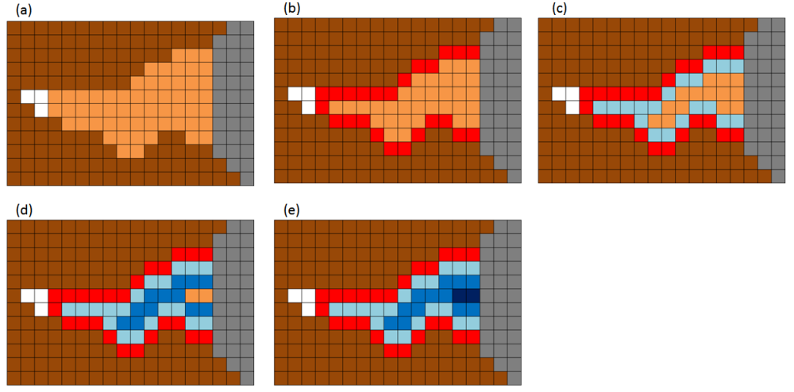
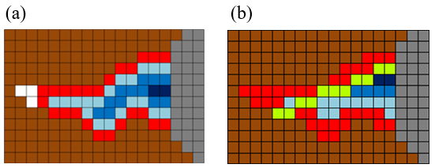
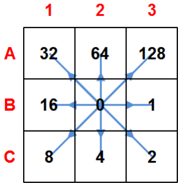
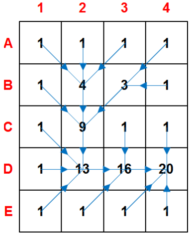
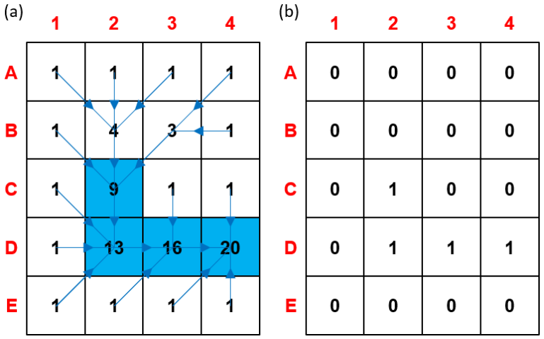

# Hydrological Analysis {#hydrological-analysis}

## DEM Pre-processing and Correction {#DEM-Pre-processing-and-Correction}

This group of algorithms is designed to transform a raw Digital Elevation Model (DEM) into a hydrologically correct surface where water can flow uninterrupted to the watershed outlet. It addresses common DEM errors like pits (depressions), flat areas, and misalignments with known river networks. The output is a "pitless" and "conditioned" DEM that is essential for accurate flow direction, watershed delineation, and subsequent hydrological analysis.

- [simplepits](#simplepits)
- [agreedem](#agreedem)
- [flatareas](#flatareas)
- [carvev](#carvev)
- [carve](#carve)
- [fill](#fill)
- [pfs](#pfs)
- [pfsd](#pfsd)
- [removepits](#removepits)


### simplepits {#simplepits}

`simplepits` is an initial, targeted step for removing hydrological depressions (pits) from a Digital Elevation Model (DEM) while keeping changes to the terrain as small as possible. In pit removal there are three general strategies—fill, carve/breach, or hybrid. Filling is the simplest, but applying it indiscriminately can trigger a cascade: fixing one pit creates new pits in neighboring cells, which leads to further fills and can produce artificial flat areas that were not present in the original DEM. To avoid this, `simplepits` focuses only on **simple pits**—those that can be eliminated by a single, localized elevation increase without causing any neighboring cell to become a new pit. The algorithm proceeds with a controlled trial-and-error step: it tentatively raises the pit cell by a small amount, checks the surrounding cells, and **accepts** the change only if no new pits appear. If any adjacent cell becomes a pit, the change is **reverted** and that cell is labeled a **complex pit** to be handled later. Operationally, it runs in linear time with respect to the number of pit cells and is intended as a conservative first pass before more comprehensive conditioning.

In TerraHidro there are two functionalities for pit removal: `simplepits` and [`pfs`](#pfs). The `simplepits` functionality modifies **only the pit cell**. A new elevation is assigned to that cell based on the **lowest neighboring elevation plus a predefined increment** (in practice, `1e-3`). After this increment is applied, **all neighboring cells** of the pit must be checked to ensure that no new pits were created. If **none** of the neighbors becomes a pit, the original pit is considered resolved by a simple, local operation and is classified as a **simple pit**. If **any** neighbor becomes a pit, the modification is **undone** and that pit cell is deferred to `pfs`, which handles **complex pits**. 


**Figure - Simple pit resolution (a–b).** (a) Initial DEM with pit cell C2 (orange) and D8 flow directions (blue). (b) C2 is raised to the lowest neighboring cell (D3) by a small increment, eliminating the pit without creating adjacent pits; the edit is accepted as a simple-pit case. Source: Jardim (2017).

| Flag        | Description               |
|-------------|---------------------------|
| `dem` | Input raster DEM file *(e.g.,inputDEM.tif)*    |
| `output` | Output raster file *(e.g., `outputDEM.tif`)*  |

The following example demonstrates how to use `simplepits` tool from the command line:
```bash
th simplepits inputDEM.tif outputDEM.tif
```


*Reference*:

Jardim, A. C. (2017). *Direções de fluxo em modelos digitais de elevação: um método com foco na qualidade da estimativa e processamento de grande volume de dados* [Doctoral dissertation, Instituto Nacional de Pesquisas Espaciais (INPE)]. [https://sid.inpe.br/mtc-m21b/2017/05.17.13.26](http://mtc-m21b.sid.inpe.br/col/sid.inpe.br/mtc-m21b/2017/05.17.13.26/doc/publicacao.pdf?metadatarepository=sid.inpe.br/mtc-m21b/2017/05.17.13.26.57&mirror=sid.inpe.br/mtc-m21b/2013/09.26.14.25.22&languagebutton=en)

*See also*: [pfs](#pfs), [removepits](#removepits).


### agreedem {#agreedem}

`agreedem` modifies a Digital Elevation Model (DEM) **in and around a known drainage network** to improve the agreement between automatically derived flow directions and **observed/reference channels**. When the drainage extracted from a raw DEM does not align with mapped streams, `agreedem` “guides” flow by **sharpening (trenching/burning)** the elevations along the reference network and optionally **smoothing** the surrounding cells within a distance buffer. This targeted editing is especially effective over **low-relief and flat areas**, where automatic drainage extraction is most ambiguous and computationally costly (see Clarke & Burnett, 2003).

`agreedem` is **not** a complete pit/flat conditioning method on its own. It only edits elevations **on** the reference lines and **nearby** cells; therefore, a hydrologically conditioned DEM (HC-DEM) still requires **flat-area handling** and **pit removal** (e.g., `simplepits` then `pfs`) so that D8 flow directions are defined **everywhere**. In practice, drainage data are supplied as **vector lines** and first converted to a raster grid; each stream cell receives an assigned “burn” value (**stream burning**; Wang et al., 2011), producing a gridded drainage mask that `agreedem` uses together with the original DEM.

The reconditioning occurs in two coupled steps:

- **Sharpening (trenching/burning):** a fixed decrement is **subtracted** from the elevation of every **drainage cell** to carve a narrow channel along the reference lines. This intentionally introduces artificial micro-valleys that act as **flow guides** for automatic extraction.
- **Smoothing (buffered taper):** within a user-defined **buffer radius (in cells)** around the drainage, additional decrements are applied that **decrease with distance** from the line (distance-weighted). This creates a small **stepped cross-section** that transitions the trench back to the surrounding terrain, reducing artifacts and improving convergence of flow to the channel.


**Figure 3.1. Reconditioning (AgreeDEM).** Cross-section example showing a 3×3 buffer where the nearest ring to the channel receives the largest decrement, the next ring a smaller decrement, and so on; the drainage cells themselves receive a larger **burn** depth. (Illustrative values follow the narrative.)

> **Workflow note.** After running `agreedem`, proceed with **flat-area** and **pit** resolution (e.g., `flatareas` → `simplepits` → `pfs`) to obtain a final HC-DEM suitable for D8 flow direction, contributing area, and watershed delineation.

---

**Parameters**

| Flag              | Description                                                                                                                                                                                        |
|-------------------|----------------------------------------------------------------------------------------------------------------------------------------------------------------------------------------------------|
| `dem`       | Input DEM raster file (GeoTIFF), e.g., `inputDEM.tif`.                                                                                                                                            |
| `drainage`      | Input drainage network (vector `.shp` or raster grid). Vector lines are rasterized internally/externally to a grid for stream burning, e.g., `inputDrainage.shp`.                                   |
| `burn`          | Trench depth applied to drainage cells (fixed decrement), e.g., `50`.                                                                                                                              |
| `buffer`        | Buffer radius **in cells** around drainage for smoothing (distance-weighted taper), e.g., `3`.                                                                                                     |
| `smooth`        | Smoothing factor that scales decrements within the buffer (larger values yield stronger taper near the channel), e.g., `10`.                                                                       |
| `burn-only`     | Optional switch to **disable smoothing** and apply trenching only on drainage cells.                                                                                                               |
| `-output`    | Output reconditioned DEM (GeoTIFF), e.g., `outputDEM.tif`.                                                                                                                                        |

The following example demonstrates how to use `agreedem` tool from the command line:
```bash
th agreedem inputDEM.tif inputDrainage.shp BURN BUFFER SMOOTH outputDEM.tif
```
Example (illustrative):
```bash
th agreedem inputDEM.tif inputDrainage.shp 20 3 10 outputDEM.tif
```

*Reference*:

Clarke, S., & Burnett, K. (2003). Comparison of digital elevation models for aquatic data development. Photogrammetric Engineering & Remote Sensing, 69(12), 1367-1375. [https://doi.org/10.14358/PERS.69.12.1367](https://doi.org/10.14358/PERS.69.12.1367)

Wang, J., Li, L., Hao, Z., & Gourley, J. J. (2011). Stream guiding algorithm for deriving flow direction from DEM and location of main streams. IAHS-AISH Publication, 346, 198-205.

*See also*: [pfsd](#pfsd).


### flatareas  {#flatareas}

*flatareas* identifies contiguous regions of uniform elevation within a Digital Elevation Model (DEM). The tool scans the input raster for adjacent cells possessing identical elevation values. It then groups these cells into distinct flat features.

The algorithm requires a user-defined minimum area threshold, specified as a number of cells. This parameter excludes smaller, potentially insignificant flat zones from the output. The result is a raster layer where each flat area is classified, providing a basis for subsequent hydrological conditioning procedures.

`flatareas` identifies **flat areas**—contiguous clusters of cells with the **same elevation**—and outputs a raster mask to be used in the next step (carving) so that flow lines can pass through the **center of wide rivers** and large flats. Flat areas are common in DEMs such as **SRTM**, **AW3D30**,  and **Copernicus DEM** where river widths exceed grid resolution; they often appear as a “staircase” along the longitudinal profile, and every cell within a flat behaves like a pit, increasing the cost of hydrologic conditioning. By first mapping these flats, subsequent processing can **dig a V-shaped channel** from the edges toward the center, reducing the number of pits and guiding drainage.

The original detection approach uses a simple **image filter** rather than an expensive region-growing segmentation. The filter has two parts: an **inner 3×3 square** (central test) and an **outer cross** (expansion). The kernel is swept from the upper-left to the lower-right of the DEM. At each position, if all cells in the inner square share the central cell’s elevation, then any cells in the outer cross that also match are **marked as flat**. Cells with invalid/NoData elevation (e.g., ocean mask values such as `-32768`) are ignored. This produces large connected flat patches efficiently. In Figure below (Identifying flat areas), intermediate steps (e.g., 26a and 26b) show the inner test and subsequent marking; by the final pass (step 112) most flat cells are identified. A few unmarked cells may remain, but they do **not** affect the next stage, which **carves** these flats.

An enhanced variant uses a **breadth-first flood fill** (8-connected: orthogonal and diagonal neighbors), starting from each valid cell, to visit all equal-elevation neighbors exactly once. This ensures complete detection with **\(O(n)\)** complexity (each DEM cell is processed once) and naturally selects diagonal borders as well as orthogonal ones. After each component is discovered, it is retained as a flat area only if it meets the **minimum size** (cell count) specified by the user.


**Figure 3.2. Identifying flat areas.** DEM cells with distinct elevations (brown) surround a flat river reach (white); gray cells are invalid/NoData (e.g., ocean/border). The 3×3 **inner square** (red) and **outer cross** (green) filter identify and mark the flat region (orange). By step 112, nearly all flat cells are tagged; any remaining unmarked cells are corrected during the subsequent carving stage. Source: Jardim (2017).

---

**Parameters**

| Flag            | Description                                                                                                  |
|-----------------|--------------------------------------------------------------------------------------------------------------|
| `dem`     | Input DEM raster (GeoTIFF), e.g., `inputDEM.tif`.                                                            |
| `min-cells`   | Positive integer for the **minimum contiguous cell count** required to classify a region as a flat area.     |
| `output`  | Output **flat-areas mask** (GeoTIFF), e.g., `outputFlatAreas.tif` (e.g., 1 = flat, 0 = non-flat).           |

The following example demonstrates how to use `flatareas` tool from the command line:
```bash
th flatareas inputDEM.tif MINCELLS outputFlatAreas.tif
```
Example:
```bash
th flatareas inputDEM.tif 25 outputFlatAreas.tif
```
*Reference*:

Jardim, A. C. (2017). *Direções de fluxo em modelos digitais de elevação: um método com foco na qualidade da estimativa e processamento de grande volume de dados* [Doctoral dissertation, Instituto Nacional de Pesquisas Espaciais (INPE)]. [https://sid.inpe.br/mtc-m21b/2017/05.17.13.26](http://mtc-m21b.sid.inpe.br/col/sid.inpe.br/mtc-m21b/2017/05.17.13.26/doc/publicacao.pdf?metadatarepository=sid.inpe.br/mtc-m21b/2017/05.17.13.26.57&mirror=sid.inpe.br/mtc-m21b/2013/09.26.14.25.22&languagebutton=en)

*See also*: [carvev](#carvev), [carve](#carve).

### carvev  {#carvev}

`carvev` detects **flat areas** in a DEM and **carves them from the borders toward the center** to form a V-shaped cross-section, guiding drainage through the midline of wide rivers and extensive flats. Unlike workflows that first require an explicit flat-area mask, `carvev` **identifies flats internally** and then performs the carving step; you do **not** need to run `flatareas` beforehand.

The algorithm first locates the **orthogonal border** of each flat (only horizontal/vertical adjacencies are considered borders; neighbors marked as invalid/NoData—e.g., ocean or DEM edges—are not treated as borders). It then **decrements the elevation** of all border cells by a small initial step and removes those cells from the flat set. The process repeats in **rounds**, each time re-identifying the new orthogonal border and applying decrements, progressively moving inward until **no flat cells remain**. This produces a **stepped V profile**: higher steps at the outer edges, lower steps toward the center, so that subsequent flow-direction and contributing-area calculations follow the **centerline** of the river/plain rather than hugging one bank. Special handling avoids carving from ocean/border toward the interior, preventing unrealistic flow from sea to land.

This pre-processing **drastically reduces the number of pits** in flats and accelerates downstream conditioning: after `carvev`, only a smaller set of residual depressions typically remains for `simplepits` and `pfs`, improving both robustness and performance.


**Figure - Demonstration of V-shaped carving of flat areas**. (a) Identify flats and their **orthogonal borders**; (b–e) iteratively decrement border elevations and move inward, forming a stepped V profile centered on the flat’s midline.

---

**Parameters**

| Flag           | Description                                                                                   |
|----------------|-----------------------------------------------------------------------------------------------|
| `dem`    | Input DEM raster (GeoTIFF), e.g., **(e.g.,inputDEM.tif)**.                                             |
| `output` | Output DEM (GeoTIFF) with flat areas carved in V-shape **(e.g., `outputDEM.tif`)**.                |

The following example demonstrates how to use `carvev` tool from the command line:
```bash
th carvev inputDEM.tif outputDEM.tif
```
*Reference*:

Jardim, A. C. (2017). *Direções de fluxo em modelos digitais de elevação: um método com foco na qualidade da estimativa e processamento de grande volume de dados* [Doctoral dissertation, Instituto Nacional de Pesquisas Espaciais (INPE)]. [https://sid.inpe.br/mtc-m21b/2017/05.17.13.26](http://mtc-m21b.sid.inpe.br/col/sid.inpe.br/mtc-m21b/2017/05.17.13.26/doc/publicacao.pdf?metadatarepository=sid.inpe.br/mtc-m21b/2017/05.17.13.26.57&mirror=sid.inpe.br/mtc-m21b/2013/09.26.14.25.22&languagebutton=en)

*See also*: [flatareas](#flatareas), [carve](#carve).


### carve  {#carve}

`carve` removes **flat areas** from a DEM by carving a gentle slope **inside the flat mask produced by `flatareas`**, optionally guided by a **reference drainage network** (vector or raster). In contrast to `carvev` (which converges toward the geometric center of the flat), `carve` can force the lowest elevations to align with **mapped channels**, producing flow paths that better match observed hydrography.

> **Workflow requirement.** Run `flatareas` **first** to generate the flat-area raster; pass this raster to `carve` together with the original DEM and the reference drainage network (if used).

**How it works (summary).**  
1) From the input **flat-area mask**, `carve` selects the **border cells** of each flat region according to a user-chosen neighborhood (orthogonal, diagonal, or all directions).  
2) If a **reference drainage** is enabled, cells on the drainage within the flat are treated as the **lowest targets**, so the carving preferentially guides slopes **toward the mapped channel**.  
3) The algorithm iteratively **decrements** border elevations and re-identifies new borders, moving inward like a **stepped V-profile** until the flat is removed. If drainage is not used, the carving converges **toward the center** (behavior similar to `carvev`).  
4) Any remaining uncarved flat cells at the end are adjusted with the last decrement step; if drainage is active, stream cells receive the **smallest (lowest) elevation** to ensure convergence to the channel.



**Figure - Comparison of the final stage between `carvev` and `carve`**. (a) original V-shaped notch (`carvev`, centered), (b) improved notch (`carve`, aligned with the reference drainage), the green pixels correspond to a reference drainage.  


---

**Parameters**

| Flag / Value        | Description                                                                                                                                                                                                                         |
|---------------------|-------------------------------------------------------------------------------------------------------------------------------------------------------------------------------------------------------------------------------------|
| `dem`         | Input DEM (GeoTIFF) (e.g., **inputDEM.tif**).                                                                                                                                                                                          |
| `drainage`        | Input **reference drainage** (vector `.shp` or raster). When enabled (`DRNON`), carving aligns the lowest elevations with the drainage inside each flat. If disabled (`DRNOFF`), carving converges toward the **center** (like `carvev`). |
| `--flat`            | Input **flat-areas raster** (GeoTIFF) produced by `flatareas` (e.g., **inputFlatAreas.tif**). **Required.**                                                                                                                           |
| `DRNON | DRNOFF`    | Use drainage? `DRNON` = **use** drainage to guide carving; `DRNOFF` = **do not** use drainage (center-focused carving).                                                                                                             |
| `CROSS | DIAG | ALL`| Border-definition rule for each iteration: `CROSS` = orthogonal neighbors; `DIAG` = diagonal neighbors; `ALL` = eight-direction neighbors.                                                                                          |
| `-o, --output`      | Output DEM (GeoTIFF) with flat areas carved (e.g., **outputDEM.tif**).                                                                                                                                                                 |

The following example demonstrates how to use `carve` tool from the command line:
```bash
th carve inputDEM.tif inputDrainage.shp inputFlatAreas.tif DRNON|DRNOFF CROSS|DIAG|ALL outputDEM.tif
```

Example (illustrative):
```bash
th carve inputDEM.tif inputDrainage.shp FlatAreas.tif DRNON ALL outputDEM.tif
```

**Author**: Dr. Henrique Rennó de Azeredo Freitas

*See also*: [flatareas](#flatareas), [carvev](#carvev).


### fill  {#fill}

`fill` repairs missing-data holes (voids/NoData) in a DEM by fusing it with a reference DEM that provides elevation inside the voids. The tool uses a separate, often coarser-resolution, reference DEM to supply elevation values for these regions. This is **not** the same as the “**fill sinks**” hydrologic operation found in SAGA GIS, GRASS, etc.  
- **This tool:** fills voids where the DEM has no data (e.g., SRTM gaps).  
- **Fill sinks (other software):** alters elevations to remove hydrologic depressions in valid data.  
Use `fill` early in the workflow to produce a complete, gap-free DEM before hydrologic conditioning (`agreedem`, `flatareas`/`carve` or `carvev`, `simplepits`, `pfs`, etc.).

**How it works (summary).**  
`fill` implements a modified **Delta Surface Fill** (Grohman et al., 2006): it derives a smooth difference (“delta”) between overlapping, valid portions of the input DEM and the reference DEM, then uses that delta to **blend** elevations seamlessly inside voids so that transitions at void boundaries are **undetectable**.

> **Best practices.** Make sure the input and reference DEMs are in the **same projection**.

---

**Parameters**

| Flag              | Description                                                                                           |
|-------------------------|-------------------------------------------------------------------------------------------------------|
| `dem`             | Input DEM (GeoTIFF) with voids, e.g., `inputDEM.tif`.                                             |
| `reference`           | Reference DEM (GeoTIFF) that supplies elevations inside voids, e.g., `referenceDEM.tif`.              |
| `output`          | Output void-filled DEM (GeoTIFF), e.g., `outputDEM.tif`.                                          |

The following example demonstrates how to use `fill` tool from the command line:
```bash
th fill inputDEM.tif referenceDEM.tif outputDEM.tif
```

*Reference*:

Grohman, G., Kroenung, G. and Strebeck, J., 2006. Filling SRTM voids: The delta surface fill method. Photogrammetric Engineering and Remote Sensing, 72(3), pp.213-216.

*See also*: [simplepits](#simplepits), [removepits](#removepits).

### pfs {#pfs}

*pfs* removes depressions from a Digital Elevation Model (DEM) using a priority-first search algorithm. The tool initiates a grid search from each pit cell to locate the nearest spill point with a lower elevation. It employs a priority queue to evaluate potential paths, constructing a descending elevation trajectory to the outlet.

This process modifies cell values along the selected path to create a hydrologically continuous surface. The algorithm ensures all depressions are resolved, producing a pit-free DEM suitable for subsequent flow-direction analysis.


`pfs` removes all remaining depressions from a DEM by **carving a path** from each pit cell to an outlet cell using a **Priority-First Search (PFS)**. Unlike `simplepits`, which changes only the pit cell, `pfs` modifies the elevations of **multiple cells** along a selected path so that flow can proceed continuously from the original pit to a lower cell. To **minimize DEM alteration**, the path is chosen to be as **short as possible** toward the **lowest reachable elevation**; if no valid interior cell is found first, the path may end at an invalid cell or at the DEM border.

The DEM is treated as a **graph** in which each grid cell is a node and neighborhood relations (typically 8-connected) are edges. Starting at the pit (initial node), PFS explores neighboring cells using a **priority queue** ordered by desirability—first by **lower elevation**, and, in case of ties, by **shorter path length** from the pit. As cells are visited, the algorithm maintains a **tree of paths** (parent–child relations) that encodes all partial routes under consideration. When PFS reaches a final cell that satisfies the stop criteria (lower elevation and shortest distance), it **commits the path** from the pit to that outlet and proceeds to modify the DEM along that path.


**Figure - PFS search to remove a pit.** The priority queue tracks, for each visited cell, its elevation, the number of steps from the pit (path length), and its parent. The final path (e.g., B2–C2–D3–D4) is committed and marked in the path tree (Jardim, 2017).

Elevation modification is applied by creating a **linear downslope** along the chosen path: moving outward from the pit, each intermediate cell along the route receives an elevation **slightly lower** than its predecessor, using a small **decrement step** (in practice, `1e-3`) applied cell by cell; the **first (pit)** and **last (outlet)** cells are not adjusted. This yields a gentle carved profile that preserves local relief while ensuring drainage continuity. To prevent creating a new pit near the outlet, PFS includes a **stop condition** that guarantees the computed elevation at the cell before the outlet will still be **higher** than the outlet’s elevation given the cumulative decrements; otherwise, the route is rejected and search continues. Border or invalid cells may also serve as terminating outlets under the stop criteria.


**Figure - DEM modification by a linear slope** . Example before (a) and after (b) applying a constant decrement along the committed path (illustrated here with a larger step of `1e-1` for clarity), leaving the pit and outlet cells unaltered (Jardim, 2017).

In practice, `pfs` complements `simplepits`: simple depressions are removed first with single-cell fills; **complex** ones are then resolved by PFS carving. The result is a **pitless DEM** suitable for reliable flow-direction, contributing-area, and drainage-network derivations, with **minimal distortion** relative to the original topography.


| Flag        | Description               |
|-------------|---------------------------|
| `dem` | Input raster DEM file *(e.g.,inputDEM.tif)*    |
| `output` | Output raster file *(e.g., `outputDEM.tif`)*  |

The following example demonstrates how to use `simplepits` tool from the command line:
```bash
th pfs inputDEM.tif outputDEM.tif
```


*Reference*:

Jones, R. (2002). Algorithms for using a DEM for mapping catchment areas of stream sediment samples. Computers & geosciences, v. 28, n. 9, p. 1051–1060. [https://doi.org/10.1016/S0098-3004(02)00022-5](https://doi.org/10.1016/S0098-3004(02)00022-5)

Jardim, A. C. (2017). *Direções de fluxo em modelos digitais de elevação: um método com foco na qualidade da estimativa e processamento de grande volume de dados* [Doctoral dissertation, Instituto Nacional de Pesquisas Espaciais (INPE)]. [https://sid.inpe.br/mtc-m21b/2017/05.17.13.26](http://mtc-m21b.sid.inpe.br/col/sid.inpe.br/mtc-m21b/2017/05.17.13.26/doc/publicacao.pdf?metadatarepository=sid.inpe.br/mtc-m21b/2017/05.17.13.26.57&mirror=sid.inpe.br/mtc-m21b/2013/09.26.14.25.22&languagebutton=en)

*See also*: [simplepits](#simplepits), [removepits](#removepits).


### pfsd {#pfsd}

`pfsd` removes all remaining pits by carving paths to outlet cells using the same **Priority-First Search (PFS)** algorithm implemented in `pfs`, with one key enhancement: processing is seeded from the reference drainage network and proceeds upstream into adjacent depressions. By anchoring the search to mapped channels, `pfsd` accelerates convergence, improves path selection near wide flats, and yields a pitless DEM whose drainage is consistent with observed hydrography.

**How it works (summary).**  
- Treat the DEM as a graph (cells = nodes; 8-connected neighbors = edges).  
- Initialize the PFS frontier on drainage cells (vector lines rasterized internally if needed).  
- For each encountered pit, build a candidate tree of paths ordered by lower elevation and, on ties, shorter distance to the channel; commit the first path that satisfies the outlet criteria.  
- Carve a gentle linear downslope along the committed path (small per-cell decrements), ensuring continuous flow from the pit to the outlet without over-smoothing.  
- Iterate upstream until no depressions remain.

**When to use.** Choose `pfsd` when a reference drainage is available and you want pit removal to follow mapped channels. For projects without a drainage reference, use `pfs`.

---

::: callout-note
**Workflow note.** A common conditioning chain is:
`agreedem` (optional) → `flatareas` + `carve` (or `carvev`) → `simplepits` → **`pfsd`**.
Using `pfsd` at the end aligns remaining pit removal with the reference drainage, improving hydrologic realism and efficiency.
:::


**Parameters**

| Flag          | Description                                                                                           |
|---------------------|-------------------------------------------------------------------------------------------------------|
| `-dem`         | Input DEM (GeoTIFF) (e.g., **inputDEM.tif**).                                                            |
| `drainage`        | Reference drainage network (vector `.shp` or raster). Used to seed PFS from channels upstream.        |
| `-output`      | Output **pitless** DEM (GeoTIFF) after PFS carving (e.g., **outputDEM.tif**).                            |

The following example demonstrates how to use `pfsd` tool from the command line:
```bash
th pfsd inputDEM.tif inputDrainage.shp outputDEM.tif
```


*Reference*:

Jones, R. (2002). Algorithms for using a DEM for mapping catchment areas of stream sediment samples. Computers & geosciences, v. 28, n. 9, p. 1051–1060. [https://doi.org/10.1016/S0098-3004(02)00022-5](https://doi.org/10.1016/S0098-3004(02)00022-5)

*Author*: Dr. Henrique Rennó de Azeredo Freitas

*See also*: [pfs](#pfs), [removepits](#removepits).


### removepits {#removepits}

`removepits` performs a full hydrologic correction of a DEM using a **hybrid approach** that both fills and carves where appropriate, minimizing unnecessary elevation changes while ensuring continuous drainage. It is the **preferred one-pass procedure** when you want a **pitless DEM** without supplying a reference drainage network.

**What it does (three phases).**  
`removepits` internally executes, in sequence:

1) **`carvev`** — identifies flat areas and carves them **V-shaped** from the borders toward the center, guiding flow through the flat midline and drastically reducing the number of depressions in these regions;  
2) **`simplepits`** — applies **selective single-cell filling** to remove only those depressions that can be fixed by a minimal local raise **without** creating new pits;  
3) **`pfs`** — uses **Priority-First Search** to **carve** a gentle downslope path from any remaining (complex) pits to an outlet cell, completing the elimination of depressions.

By combining targeted fill sinks (phase 2) with controlled carving (phases 1 and 3), `removepits` is a **hybrid method** designed to preserve local relief while producing reliable D8 flow directions across the entire grid.

---

**Parameters**

| Flag      | Description                                                                                              |
|-----------------|----------------------------------------------------------------------------------------------------------|
| `dem`     | Input DEM (GeoTIFF) (e.g., *inputDEM.tif*).                                                               |
| `output`  | Output **pitless** DEM (GeoTIFF) with flats carved and simple/complex pits removed (*e.g., `outputDEM.tif*). |

The following example demonstrates how to use `removepits` tool from the command line:
```bash
th removepits inputDEM.tif outputDEM.tif
```

*Reference*:

Jardim, A. C. (2017). *Direções de fluxo em modelos digitais de elevação: um método com foco na qualidade da estimativa e processamento de grande volume de dados* [Doctoral dissertation, Instituto Nacional de Pesquisas Espaciais (INPE)]. [https://sid.inpe.br/mtc-m21b/2017/05.17.13.26](http://mtc-m21b.sid.inpe.br/col/sid.inpe.br/mtc-m21b/2017/05.17.13.26/doc/publicacao.pdf?metadatarepository=sid.inpe.br/mtc-m21b/2017/05.17.13.26.57&mirror=sid.inpe.br/mtc-m21b/2013/09.26.14.25.22&languagebutton=en)

*See also*: [carvev](#carvev), [simplepits](#simplepits), [pfs](#pfs).

## Flow Analysis, Drainage Network Extraction and Characterization {#Flow-Analysis-Drainage-Network-Extraction-and-Characterization}

- [d8](#d8)  
- [d8ca](#d8ca)  
- [d8drainage](#d8drainage)  
- [d8drainagev](#d8drainagev)  
- [segments](#segments)  
- [minibasins](#minibasins)  
- [outletbasin](#outletbasin)  
- [mainriver](#mainriver)  
- [shreve](#shreve)  
- [strahler](#strahler)  
- [ottorivers](#ottorivers)  
- [mouths](#mouths)  
- [orderedmouths](#orderedmouths)
- [ottorivers](#ottorivers)  

### d8 {#d8} 


`d8` computes the local drainage direction (flow direction) for each DEM cell using the classic **D8** method (O’Callaghan & Mark, 1984). For every valid cell, the algorithm compares the eight neighbors and assigns the direction of steepest descent. Cells with no downslope neighbor (e.g., flats/pits not yet conditioned, borders, or NoData) receive 0.

> **Prerequisite.** Use a **hydrologically conditioned** DEM (pitless and flat areas treated), typically produced with `removepits` (or the equivalent sequence `carvev` → `simplepits` → `pfs`, or `pfsd` when a reference drainage is used).

**Direction codes (powers of two).**  
The output raster stores a power-of-two code indicating the outflow neighbor:

| Code | Direction | Offset (row, col) |
|-----:|:----------|:------------------|
| 1    | E         | (0, +1)           |
| 2    | SE        | (+1, +1)          |
| 4    | S         | (+1, 0)           |
| 8    | SW        | (+1, −1)          |
| 16   | W         | (0, −1)           |
| 32   | NW        | (−1, −1)          |
| 64   | N         | (−1, 0)           |
| 128  | NE        | (−1, +1)          |
| 0    | Invalid / No downslope / NoData |




**Figure. Codes and corresponding flow directions (compass layout)**.

> **Notes.**  
> • Ties are uncommon after proper conditioning; if present, the tool resolves to one neighbor or yields 0 when no descent exists.  
> • Cells touching NoData or the DEM boundary may legitimately output 0.  
> • The D8 flow direction is the basis for contributing area, stream extraction, stream ordering, and watershed delineation.

---

**Parameters**

| Flag     | Description                                                                                   |
|----------------|-----------------------------------------------------------------------------------------------|
| `dem`    | Input **hydrologically conditioned** DEM (GeoTIFF) (e.g., *inputDEM.tif*).                     |
| `output` | Output **D8 flow direction** raster (GeoTIFF) (e.g., *flowdir.tif*).                           |

The following example demonstrates how to use `d8` tool from the command line:
```bash
th d8 inputDEM.tif flowdir.tif
```

*Reference*:

O'Callaghan, J. F., & Mark, D. M. (1984). The extraction of drainage networks from digital elevation data. Computer vision, graphics, and image processing, 28(3), 323-344.[https://doi.org/10.1016/S0734-189X(84)80011-0](https://doi.org/10.1016/S0734-189X(84)80011-0)

*See also*: [d8ca](#d8ca).

### d8ca {#d8ca} 

`d8ca` computes the **contributing area** (a.k.a. flow accumulation) by following a **D8 flow-direction** grid and counting how many cells drain to each location, including the cell itself (single-flow-direction; no divergence). This produces a raster in which hillslopes have small values and channels concentrate large values.

> **Prerequisite.** Use a D8 flow-direction raster produced by `d8` from a hydrologically conditioned (pitless) DEM.



**Figure.** Contributing area derived from a D8 grid.

---

**Behavior & output**
- **Method:** Single-flow-direction (**SFD**): each cell routes its discharge to one downslope neighbor (O’Callaghan & Mark, 1984).  
- **Default units:** cell counts (number of upslope cells).  
- **NoData handling:** cells with NoData in the input D8 raster become **NoData** in the output.

---

**Parameters**

| Flag     | Description                                                                                           |
|----------------|-------------------------------------------------------------------------------------------------------|
| `input`  | Input D8 flow-direction raster (GeoTIFF) (e.g., *inputD8.tif*).                                    |
| `output` | Output D8 contributing area (GeoTIFF) (e.g., *outputD8ContributingArea.tif*).                      |

The following example demonstrates how to use `d8ca` tool from the command line:
```bash
th d8ca inputD8.tif outputD8ContributingArea.tif
```
*Reference*:

O'Callaghan, J. F., & Mark, D. M. (1984). The extraction of drainage networks from digital elevation data. Computer vision, graphics, and image processing, 28(3), 323-344.[https://doi.org/10.1016/S0734-189X(84)80011-0](https://doi.org/10.1016/S0734-189X(84)80011-0)

*See also*: [d8](#d8).

### d8drainage {#d8drainage}  

`d8drainage` maps the drainage network by applying a threshold to a D8 contributing area raster (`d8ca`). Each cell is assigned 1 (stream) if its contributing area is greater than or equal to the specified threshold, and 0 otherwise. The result is a binary stream grid suitable for stream ordering, vectorization, and watershed delineation.



**Figure - Drainage network derived from a D8 contributing-area grid using a minimum-area threshold**.

> **Prerequisite.** Use a contributing-area raster produced by `d8ca` from a hydrologically conditioned DEM and its corresponding `d8` flow directions.

---

**Choosing the threshold (guidance)**  
- The threshold represents the **minimum upslope area** needed to initiate/maintain a channel (area used as a surrogate for discharge).  
- **Smaller** thresholds ⇒ **denser** networks; **larger** thresholds ⇒ **sparser** networks.  
- There is no universal value: it depends on **terrain, climate, lithology**, and **grid resolution**.  
- Common practice: inspect maps/imagery, test a range of values, and select the one that best matches **known channels**.

**Behavior & data handling**  
- Input NoData cells remain **NoData** in the output (not classified as streams).  
- Threshold is provided **in cells** (i.e., count of upslope cells).

---

**Parameters**

| Flag        | Description                                                                                                   |
|-------------------|---------------------------------------------------------------------------------------------------------------|
| `input`     | Input **D8 contributing area** raster (GeoTIFF), (e.g. *inputContributingArea.tif*).                           |
| `output`    | Output **binary drainage network** raster (GeoTIFF) (e.g., *outputDrainage.tif* (1 = stream, 0 = non-stream). |
| `thresholdValue`  | **Minimum contributing area** (in cells) to classify a cell as stream.                                     |

The following example demonstrates how to use `d8ca` tool from the command line:
```bash
th d8drainage inputContributingArea.tif outputDrainage.tif thresholdValue
```
Example:
```
th d8drainage d8ca.tif drainage.tif 2000
```

> **Tip** Start with a broad sweep (e.g., 300, 500, 1000, 2000, 5000 cells), compare against known hydrography or high-resolution imagery, then refine the threshold for your study area..


*See also*: [d8](#d8), [d8ca](#d8ca).

### d8drainagev {#d8drainagev}

`d8drainagev` converts a binary drainage raster (e.g., from `d8drainage`) into vector polylines by following the D8 flow-direction raster. The tool traverses stream cells from sources (no inflowing neighbors) downstream along the D8 directions, assembling connected cell pairs into line features that represent stream segments.


**How it works (summary).**  
- Reads the **drainage raster** (1 = stream, 0 = non-stream; NoData ignored) and the matching **D8 direction** raster.  
- Detects **headwater cells** (stream cells with no upstream contributors) and traces **downstream paths** by following the D8 pointer of each cell.  
- Builds **polyline features** for each connected path; branching and confluences are preserved by starting new lines as needed.  
- Outputs a **vector line** dataset suitable for ordering, attribution, and cartographic display.


---

**Parameters**

| Flag        | Description                                                                                     |
|-------------------|-------------------------------------------------------------------------------------------------|
| `drainage`  | Input **drainage network** raster (GeoTIFF), e.g., `inputDrainage.tif` (1 = stream, 0 = else). |
| `d8`            | Input **D8 flow-direction** raster (GeoTIFF), e.g., `inputD8.tif`.                              |
| `output`    | Output **vector drainage network** (e.g., ESRI Shapefile), e.g., `outputDrainage.shp`.         |

> **Notes** 
• Ensure the drainage raster is topologically coherent with the D8 grid (both produced from the same DEM).
• The drainage grid and D8 grid must share the same extent, pixel size, and alignment
• NoData and non-stream cells are skipped; only cells marked as stream are traced.
• The resulting lines can be post-processed (e.g., smoothing, ordering, attribute joins) according to project needs.


The following example demonstrates how to use `d8ca` tool from the command line:
```bash
th d8drainagev inputDrainage.tif inputD8.tif outputDrainage.shp
```
*See also*: [d8](#d8), [d8ca](#d8ca), [d8drainage](#d8drainage).

### segments {#segments}  
### minibasins {#minibasins}  
### outletbasin {#outletbasin}  
### mainriver {#mainriver}  
### shreve {#shreve}  
### strahler {#strahler}  
### ottorivers {#ottorivers}  
### mouths {#mouths}  
### orderedmouths {#orderedmouths}  
### ottorivers {#ottorivers} 

## Basin and Sub-basin Delineation {#Basin-and-Sub-basin-Delineation}

- [minibasins](#minibasins)  
- [outletbasin](#outletbasin)  
- [ottobasins](#ottobasins)  


### minibasins {#minibasins}  
### outletbasin {#outletbasin}  
### ottobasins {#ottobasins}  
 


## Geomorphometric analysis {#Geomorphometric-analysis}

- [tpi](#tpi)  
- [hand](#hand)  
- [sand](#sand)  
- [d8slope](#d8slope)  

### tpi {#tpi}  
### hand {#hand}  
### sand {#sand}  
### d8slope {#d8slope}  


## Applied Hydrology & Risk Management {#Applied-Hydrology-Risk-Management}

- [gfplain](#gfplain)  
- [flowpath](#flowpath)  
- [damcourse](#damcourse)  
- [damsections](#damsections)  
- [dambreak](#dambreak)  

### gfplain {#gfplain}  
### flowpath {#flowpath}  
### damcourse {#damcourse}  
### damsections {#damsections}  
### dambreak {#dambreak}  


