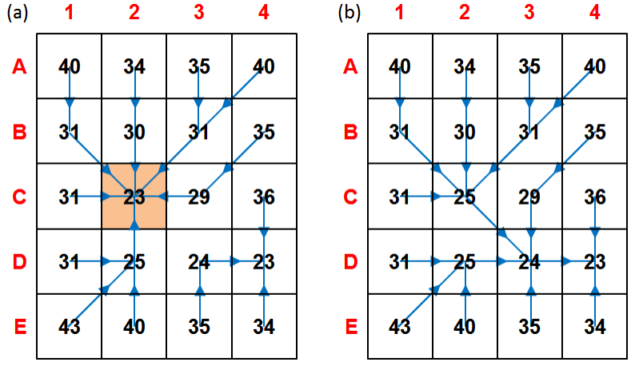
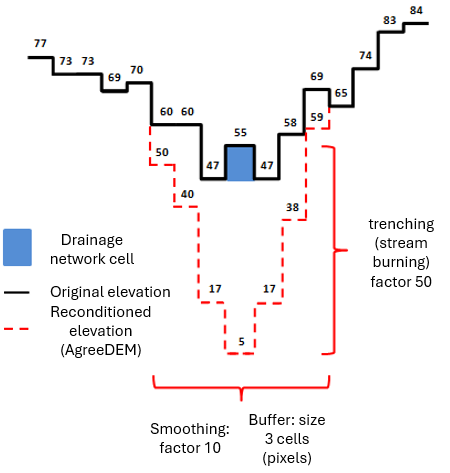
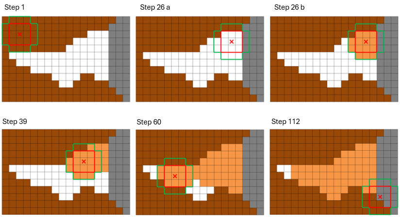
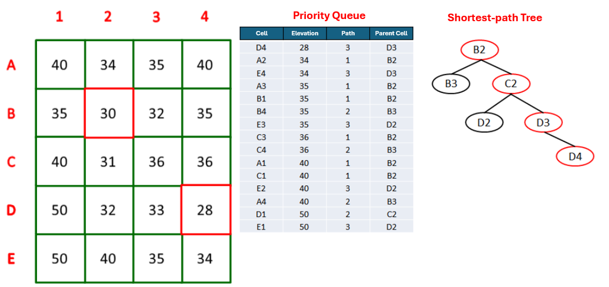
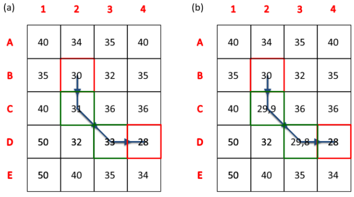

# Hydrological Analysis {#hydrological-analysis}

## DEM Pre-processing and Correction {#DEM-Pre-processing-and-Correction}

This group of algorithms is designed to transform a raw Digital Elevation Model (DEM) into a hydrologically correct surface where water can flow uninterrupted to the watershed outlet. It addresses common DEM errors like pits (depressions), flat areas, and misalignments with known river networks. The output is a "pitless" and "conditioned" DEM that is essential for accurate flow direction, watershed delineation, and subsequent hydrological analysis.

- [simplepits](#simplepits)
- [agreedem](#agreedem)
- [carve](#carve)
- [carvev](#carvev)
- [fill](#fill)
- [flatareas](#flatareas)
- [pfs](#pfs)
- [pfsd](#pfsd)
- [removepits](#removepits)


### simplepits {#simplepits}

`simplepits` is an initial, targeted step for removing hydrological depressions (pits) from a Digital Elevation Model (DEM) while keeping changes to the terrain as small as possible. In pit removal there are three general strategies—fill, carve/breach, or hybrid. Filling is the simplest, but applying it indiscriminately can trigger a cascade: fixing one pit creates new pits in neighboring cells, which leads to further fills and can produce artificial flat areas that were not present in the original DEM. To avoid this, `simplepits` focuses only on **simple pits**—those that can be eliminated by a single, localized elevation increase without causing any neighboring cell to become a new pit. The algorithm proceeds with a controlled trial-and-error step: it tentatively raises the pit cell by a small amount, checks the surrounding cells, and **accepts** the change only if no new pits appear. If any adjacent cell becomes a pit, the change is **reverted** and that cell is labeled a **complex pit** to be handled later. Operationally, it runs in linear time with respect to the number of pit cells and is intended as a conservative first pass before more comprehensive conditioning.

In TerraHidro there are two functionalities for pit removal: `simplepits` and [`pfs`](#pfs). The `simplepits` functionality modifies **only the pit cell**. A new elevation is assigned to that cell based on the **lowest neighboring elevation plus a predefined increment** (in practice, `1e-3`). After this increment is applied, **all neighboring cells** of the pit must be checked to ensure that no new pits were created. If **none** of the neighbors becomes a pit, the original pit is considered resolved by a simple, local operation and is classified as a **simple pit**. If **any** neighbor becomes a pit, the modification is **undone** and that pit cell is deferred to `pfs`, which handles **complex pits**. 



**Figure - Simple pit resolution (a–b).** (a) Initial DEM with pit cell C2 (orange) and D8 flow directions (blue). (b) C2 is raised to the lowest neighboring cell (D3) by a small increment, eliminating the pit without creating adjacent pits; the edit is accepted as a simple-pit case. Source: Jardim (2017).

| Flag        | Description               |
|-------------|---------------------------|
| `dem` | Input raster DEM file *(e.g.,inputDEM.tif)*    |
| `output` | Output raster file *(e.g., `outputDEM.tif`)*  |

The following example demonstrates how to use `simplepits` tool from the command line:
```bash
th simplepits inputDEM.tif outputDEM.tif
```


*Reference*:

Jardim, A. C. (2017). *Direções de fluxo em modelos digitais de elevação: um método com foco na qualidade da estimativa e processamento de grande volume de dados* [Doctoral dissertation, Instituto Nacional de Pesquisas Espaciais (INPE)]. [https://sid.inpe.br/mtc-m21b/2017/05.17.13.26](http://mtc-m21b.sid.inpe.br/col/sid.inpe.br/mtc-m21b/2017/05.17.13.26/doc/publicacao.pdf?metadatarepository=sid.inpe.br/mtc-m21b/2017/05.17.13.26.57&mirror=sid.inpe.br/mtc-m21b/2013/09.26.14.25.22&languagebutton=en)

*See also*: [pfs](#pfs), [removepits](#removepits).


### agreedem {#agreedem}

`agreedem` modifies a Digital Elevation Model (DEM) **in and around a known drainage network** to improve the agreement between automatically derived flow directions and **observed/reference channels**. When the drainage extracted from a raw DEM does not align with mapped streams, `agreedem` “guides” flow by **sharpening (trenching/burning)** the elevations along the reference network and optionally **smoothing** the surrounding cells within a distance buffer. This targeted editing is especially effective over **low-relief and flat areas**, where automatic drainage extraction is most ambiguous and computationally costly (see Clarke & Burnett, 2003).

`agreedem` is **not** a complete pit/flat conditioning method on its own. It only edits elevations **on** the reference lines and **nearby** cells; therefore, a hydrologically conditioned DEM (HC-DEM) still requires **flat-area handling** and **pit removal** (e.g., `simplepits` then `pfs`) so that D8 flow directions are defined **everywhere**. In practice, drainage data are supplied as **vector lines** and first converted to a raster grid; each stream cell receives an assigned “burn” value (**stream burning**; Wang et al., 2011), producing a gridded drainage mask that `agreedem` uses together with the original DEM.

The reconditioning occurs in two coupled steps:

- **Sharpening (trenching/burning):** a fixed decrement is **subtracted** from the elevation of every **drainage cell** to carve a narrow channel along the reference lines. This intentionally introduces artificial micro-valleys that act as **flow guides** for automatic extraction.
- **Smoothing (buffered taper):** within a user-defined **buffer radius (in cells)** around the drainage, additional decrements are applied that **decrease with distance** from the line (distance-weighted). This creates a small **stepped cross-section** that transitions the trench back to the surrounding terrain, reducing artifacts and improving convergence of flow to the channel.


**Figure 3.1. Reconditioning (AgreeDEM).** Cross-section example showing a 3×3 buffer where the nearest ring to the channel receives the largest decrement, the next ring a smaller decrement, and so on; the drainage cells themselves receive a larger **burn** depth. (Illustrative values follow the narrative.)

> **Workflow note.** After running `agreedem`, proceed with **flat-area** and **pit** resolution (e.g., `flatareas` → `simplepits` → `pfs`) to obtain a final HC-DEM suitable for D8 flow direction, contributing area, and watershed delineation.

---

**Parameters**

| Flag              | Description                                                                                                                                                                                        |
|-------------------|----------------------------------------------------------------------------------------------------------------------------------------------------------------------------------------------------|
| `dem`       | Input DEM raster file (GeoTIFF), e.g., `inputDEM.tif`.                                                                                                                                            |
| `drainage`      | Input drainage network (vector `.shp` or raster grid). Vector lines are rasterized internally/externally to a grid for stream burning, e.g., `inputDrainage.shp`.                                   |
| `burn`          | Trench depth applied to drainage cells (fixed decrement), e.g., `50`.                                                                                                                              |
| `buffer`        | Buffer radius **in cells** around drainage for smoothing (distance-weighted taper), e.g., `3`.                                                                                                     |
| `smooth`        | Smoothing factor that scales decrements within the buffer (larger values yield stronger taper near the channel), e.g., `10`.                                                                       |
| `burn-only`     | Optional switch to **disable smoothing** and apply trenching only on drainage cells.                                                                                                               |
| `-output`    | Output reconditioned DEM (GeoTIFF), e.g., `outputDEM.tif`.                                                                                                                                        |

The following example demonstrates how to use `agreedem` tool from the command line:
```bash
th agreedem inputDEM.tif inputDrainage.shp BURN BUFFER SMOOTH outputDEM.tif
```
Example (illustrative):
```bash
th agreedem inputDEM.tif inputDrainage.shp 20 3 10 outputDEM.tif
```

*Reference*:

Clarke, S., & Burnett, K. (2003). Comparison of digital elevation models for aquatic data development. Photogrammetric Engineering & Remote Sensing, 69(12), 1367-1375. [https://doi.org/10.14358/PERS.69.12.1367](https://doi.org/10.14358/PERS.69.12.1367)

Wang, J., Li, L., Hao, Z., & Gourley, J. J. (2011). Stream guiding algorithm for deriving flow direction from DEM and location of main streams. IAHS-AISH Publication, 346, 198-205.

*See also*: [pfsd](#pfsd).

### carve  {#carve}

*carve* processes flat areas in a Digital Elevation Model (DEM) by creating an artificial drainage path. The algorithm modifies cell elevations to introduce a slope, enabling hydrological flow routing. It optionally uses a reference drainage network to guide the carving process, ensuring the resulting channel aligns with known flow paths.

The tool requires input parameters to specify whether the drainage network is active (DRNON) and which neighboring cells define a flat area's border (CROSS, DIAG, or ALL). Unlike carvev, which converges carving toward the center of a flat area, carve uses the drainage network to direct the carving trajectory, producing a more accurate hydrological representation.

*See also*: [carvev](#carvev).

**Parameters**

| Flag             | Description                                                                                                                                                                   |
|------------------|-------------------------------------------------------------------------------------------------------------------------------------------------------------------------------|
| `-i, --dem`      | Input DEM raster file (e.g., `inputDEM.tif`).                                                                                                                                 |
| `--drainage`     | Input drainage network (vector `.shp` or raster), e.g., `inputDrainage.shp`.                                                                                                  |
| `--flat`         | Input flat-areas raster produced by the *flatareas* functionality (e.g., `inputFlatAreas.tif`).                                                                               |
| `--use-drainage` | Defines if the drainage network must be used: <br/>• `DRNON` – converge ao canal <br/>• `DRNOFF` – não usa a rede, converge ao centro das planícies (similar ao `carvev`).    |
| `--border`       | Defines which cells form the border of flat areas: <br/>• `CROSS` – vizinhos horizontais/verticais <br/>• `DIAG` – vizinhos diagonais <br/>• `ALL` – todas as direções (8).   |
| `-o, --output`   | Output DEM raster file with carved flats (e.g., `outputDEM.tif`).                                                                                                             |


**C++ function**
```bash
th carve inputDEM.tif inputDrainage.shp inputFlatAreas.tif DRNON|DRNOFF CROSS|DIAG|ALL outputDEM.tif
```


### carvev  {#carvev}

*carvev* processes flat areas in a Digital Elevation Model (DEM) by systematically decreasing elevation values from the borders toward the center. This algorithm generates an artificial slope across the feature, forming a characteristic stair-step pattern that enables hydrological flow routing. The operation functions without external drainage data, using only the DEM's own geometry to determine the carving path.

This method provides a foundational correction for hydrologic conditioning. The key distinction from carve is that carvev does not utilize a reference drainage network to guide the process, converging instead on the geometric center of the flat area.

| Flag            | Descrição                                      |
|-----------------|------------------------------------------------|
| `dem`     | Input DEM raster file *(e.g.,inputDEM.tif)*       |
| `output`  | Output DEM raster file with carved flats *(e.g., `outputDEM.tif`)*        |


**C++ function**
```bash
th carvev inputDEM.tif outputDEM.tif
```

### fill  {#fill}

*fill* corrects voids or areas of missing data in a Digital Elevation Model (DEM). The tool uses a separate, often coarser-resolution, reference DEM to supply elevation values for these regions. It replaces null or erroneous cells in the input DEM with corresponding data from the reference source.

This process generates a continuous, hydrologically viable elevation surface. The output DEM supports subsequent terrain analysis by ensuring complete spatial data coverage without interruptions.

### flatareas  {#flatareas}

*flatareas* identifies contiguous regions of uniform elevation within a Digital Elevation Model (DEM). The tool scans the input raster for adjacent cells possessing identical elevation values. It then groups these cells into distinct flat features.

The algorithm requires a user-defined minimum area threshold, specified as a number of cells. This parameter excludes smaller, potentially insignificant flat zones from the output. The result is a raster layer where each flat area is classified, providing a basis for subsequent hydrological conditioning procedures.

`flatareas` identifies **flat areas**—contiguous clusters of cells with the **same elevation**—and outputs a raster mask to be used in the next step (carving) so that flow lines can pass through the **center of wide rivers** and large flats. Flat areas are common in DEMs such as **SRTM**, **AW3D30**,  and **Copernicus DEM** where river widths exceed grid resolution; they often appear as a “staircase” along the longitudinal profile, and every cell within a flat behaves like a pit, increasing the cost of hydrologic conditioning. By first mapping these flats, subsequent processing can **dig a V-shaped channel** from the edges toward the center, reducing the number of pits and guiding drainage.

The original detection approach uses a simple **image filter** rather than an expensive region-growing segmentation. The filter has two parts: an **inner 3×3 square** (central test) and an **outer cross** (expansion). The kernel is swept from the upper-left to the lower-right of the DEM. At each position, if all cells in the inner square share the central cell’s elevation, then any cells in the outer cross that also match are **marked as flat**. Cells with invalid/NoData elevation (e.g., ocean mask values such as `-32768`) are ignored. This produces large connected flat patches efficiently. In Figure below (Identifying flat areas), intermediate steps (e.g., 26a and 26b) show the inner test and subsequent marking; by the final pass (step 112) most flat cells are identified. A few unmarked cells may remain, but they do **not** affect the next stage, which **carves** these flats.

An enhanced variant uses a **breadth-first flood fill** (8-connected: orthogonal and diagonal neighbors), starting from each valid cell, to visit all equal-elevation neighbors exactly once. This ensures complete detection with **\(O(n)\)** complexity (each DEM cell is processed once) and naturally selects diagonal borders as well as orthogonal ones. After each component is discovered, it is retained as a flat area only if it meets the **minimum size** (cell count) specified by the user.


**Figure 3.2. Identifying flat areas.** DEM cells with distinct elevations (brown) surround a flat river reach (white); gray cells are invalid/NoData (e.g., ocean/border). The 3×3 **inner square** (red) and **outer cross** (green) filter identify and mark the flat region (orange). By step 112, nearly all flat cells are tagged; any remaining unmarked cells are corrected during the subsequent carving stage. Source: Jardim (2017).

---

**Parameters**

| Flag            | Description                                                                                                  |
|-----------------|--------------------------------------------------------------------------------------------------------------|
| `dem`     | Input DEM raster (GeoTIFF), e.g., `inputDEM.tif`.                                                            |
| `min-cells`   | Positive integer for the **minimum contiguous cell count** required to classify a region as a flat area.     |
| `output`  | Output **flat-areas mask** (GeoTIFF), e.g., `outputFlatAreas.tif` (e.g., 1 = flat, 0 = non-flat).           |

The following example demonstrates how to use `flatareas` tool from the command line:
```bash
th flatareas inputDEM.tif MINCELLS outputFlatAreas.tif
```
Example:
```bash
# th flatareas inputDEM.tif 25 outputFlatAreas.tif
```


### pfs {#pfs}

*pfs* removes depressions from a Digital Elevation Model (DEM) using a priority-first search algorithm. The tool initiates a grid search from each pit cell to locate the nearest spill point with a lower elevation. It employs a priority queue to evaluate potential paths, constructing a descending elevation trajectory to the outlet.

This process modifies cell values along the selected path to create a hydrologically continuous surface. The algorithm ensures all depressions are resolved, producing a pit-free DEM suitable for subsequent flow-direction analysis.


`pfs` removes all remaining depressions from a DEM by **carving a path** from each pit cell to an outlet cell using a **Priority-First Search (PFS)**. Unlike `simplepits`, which changes only the pit cell, `pfs` modifies the elevations of **multiple cells** along a selected path so that flow can proceed continuously from the original pit to a lower cell. To **minimize DEM alteration**, the path is chosen to be as **short as possible** toward the **lowest reachable elevation**; if no valid interior cell is found first, the path may end at an invalid cell or at the DEM border.

The DEM is treated as a **graph** in which each grid cell is a node and neighborhood relations (typically 8-connected) are edges. Starting at the pit (initial node), PFS explores neighboring cells using a **priority queue** ordered by desirability—first by **lower elevation**, and, in case of ties, by **shorter path length** from the pit. As cells are visited, the algorithm maintains a **tree of paths** (parent–child relations) that encodes all partial routes under consideration. When PFS reaches a final cell that satisfies the stop criteria (lower elevation and shortest distance), it **commits the path** from the pit to that outlet and proceeds to modify the DEM along that path.


**Figure - PFS search to remove a pit.** The priority queue tracks, for each visited cell, its elevation, the number of steps from the pit (path length), and its parent. The final path (e.g., B2–C2–D3–D4) is committed and marked in the path tree (Jardim, 2017).

Elevation modification is applied by creating a **linear downslope** along the chosen path: moving outward from the pit, each intermediate cell along the route receives an elevation **slightly lower** than its predecessor, using a small **decrement step** (in practice, `1e-3`) applied cell by cell; the **first (pit)** and **last (outlet)** cells are not adjusted. This yields a gentle carved profile that preserves local relief while ensuring drainage continuity. To prevent creating a new pit near the outlet, PFS includes a **stop condition** that guarantees the computed elevation at the cell before the outlet will still be **higher** than the outlet’s elevation given the cumulative decrements; otherwise, the route is rejected and search continues. Border or invalid cells may also serve as terminating outlets under the stop criteria.


**Figure - DEM modification by a linear slope** . Example before (a) and after (b) applying a constant decrement along the committed path (illustrated here with a larger step of `1e-1` for clarity), leaving the pit and outlet cells unaltered (Jardim, 2017).

In practice, `pfs` complements `simplepits`: simple depressions are removed first with single-cell fills; **complex** ones are then resolved by PFS carving. The result is a **pitless DEM** suitable for reliable flow-direction, contributing-area, and drainage-network derivations, with **minimal distortion** relative to the original topography.


| Flag        | Description               |
|-------------|---------------------------|
| `dem` | Input raster DEM file *(e.g.,inputDEM.tif)*    |
| `output` | Output raster file *(e.g., `outputDEM.tif`)*  |

The following example demonstrates how to use `simplepits` tool from the command line:
```bash
th pfs inputDEM.tif outputDEM.tif
```


*Reference*:

Jones, R. (2002). Algorithms for using a DEM for mapping catchment areas of stream sediment samples. Computers & geosciences, v. 28, n. 9, p. 1051–1060. [https://doi.org/10.1016/S0098-3004(02)00022-5](https://doi.org/10.1016/S0098-3004(02)00022-5)

Jardim, A. C. (2017). *Direções de fluxo em modelos digitais de elevação: um método com foco na qualidade da estimativa e processamento de grande volume de dados* [Doctoral dissertation, Instituto Nacional de Pesquisas Espaciais (INPE)]. [https://sid.inpe.br/mtc-m21b/2017/05.17.13.26](http://mtc-m21b.sid.inpe.br/col/sid.inpe.br/mtc-m21b/2017/05.17.13.26/doc/publicacao.pdf?metadatarepository=sid.inpe.br/mtc-m21b/2017/05.17.13.26.57&mirror=sid.inpe.br/mtc-m21b/2013/09.26.14.25.22&languagebutton=en)

*See also*: [simplepits](#simplepits), [removepits](#removepits).


### pfsd {#pfsd}

*pfsd* removes depressions from a Digital Elevation Model (DEM) using a priority-first search algorithm that incorporates a reference drainage network. The tool prioritizes the processing of pits located on the drainage network before addressing upstream depressions. It constructs hydrologic outlets by carving descending elevation paths to the nearest lower cell.

This method ensures the resulting drainage structure aligns with the provided network. The algorithm differs from pfs by utilizing the drainage network to guide the depression-removal sequence, enhancing hydrological consistency with known channel locations.

### removepits {#removepits}

*removepits* processes a Digital Elevation Model (DEM) to eliminate hydrological depressions and flat areas. This tool executes a sequence of operations, specifically the carvev, simplepits, and pfs algorithms, to ensure comprehensive hydrological correction. It produces a fully connected drainage surface where water can flow uninterrupted to the watershed outlet.

The procedure first addresses flat regions by carving drainage paths, then removes simple pits through elevation filling, and finally resolves complex depressions via priority-first search. The output is a pit-free DEM suitable for deriving accurate flow direction and accumulation networks.


## Flow Analysis, Drainage Network Extraction and Characterization {#Flow-Analysis-Drainage-Network-Extraction-and-Characterization}

- [d8](#d8)  
- [d8ca](#d8ca)  
- [d8drainage](#d8drainage)  
- [d8drainagev](#d8drainagev)  
- [segments](#segments)  
- [minibasins](#minibasins)  
- [outletbasin](#outletbasin)  
- [mainriver](#mainriver)  
- [shreve](#shreve)  
- [strahler](#strahler)  
- [ottorivers](#ottorivers)  
- [mouths](#mouths)  
- [orderedmouths](#orderedmouths)
- [ottorivers](#ottorivers)  

### d8 {#d8}  
### d8ca {#d8ca}  
### d8drainage {#d8drainage}  
### d8drainagev {#d8drainagev}  
### segments {#segments}  
### minibasins {#minibasins}  
### outletbasin {#outletbasin}  
### mainriver {#mainriver}  
### shreve {#shreve}  
### strahler {#strahler}  
### ottorivers {#ottorivers}  
### mouths {#mouths}  
### orderedmouths {#orderedmouths}  
### ottorivers {#ottorivers} 

## Basin and Sub-basin Delineation {#Basin-and-Sub-basin-Delineation}

- [minibasins](#minibasins)  
- [outletbasin](#outletbasin)  
- [ottobasins](#ottobasins)  


### minibasins {#minibasins}  
### outletbasin {#outletbasin}  
### ottobasins {#ottobasins}  
 


## Geomorphometric analysis {#Geomorphometric-analysis}

- [tpi](#tpi)  
- [hand](#hand)  
- [sand](#sand)  
- [d8slope](#d8slope)  

### tpi {#tpi}  
### hand {#hand}  
### sand {#sand}  
### d8slope {#d8slope}  


## Applied Hydrology & Risk Management {#Applied-Hydrology-Risk-Management}

- [gfplain](#gfplain)  
- [flowpath](#flowpath)  
- [damcourse](#damcourse)  
- [damsections](#damsections)  
- [dambreak](#dambreak)  

### gfplain {#gfplain}  
### flowpath {#flowpath}  
### damcourse {#damcourse}  
### damsections {#damsections}  
### dambreak {#dambreak}  


