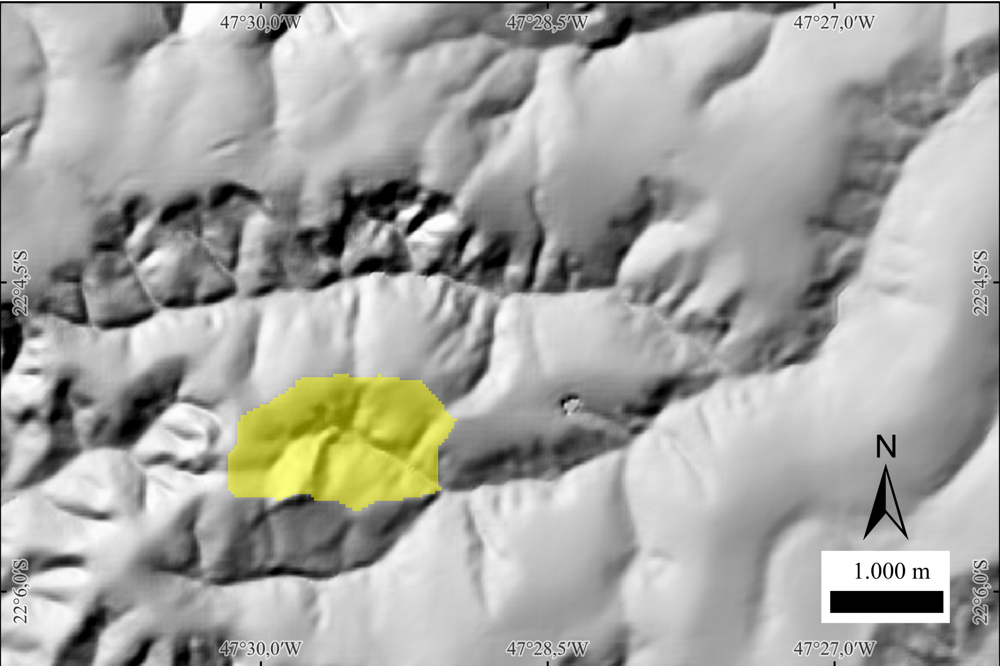
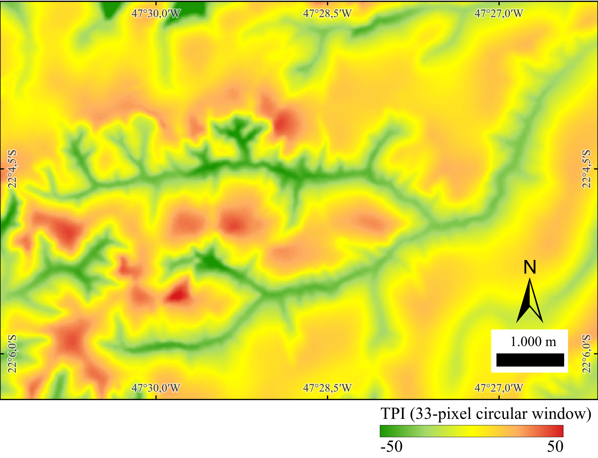

## Basin and Sub-basin Delineation {#Basin-and-Sub-basin-Delineation}

- [minibasins](#minibasins)  
- [outletbasin](#outletbasin)  
- [ottobasins](#ottobasins)  


### minibasins {#minibasins}  

`minibasins` delineates one contributing area per drainage segment using a D8 flow-direction grid and a segment-ID raster (e.g., from `segments`). Each minibasin corresponds to the set of cells whose flow reaches a single stream segment (bounded by sources, confluences, or outlet). The output raster encodes minibasins with the same unique integer IDs as their associated segments, enabling one-to-one joins between channel attributes and hillslope areas.

**How it works (summary).**  
1) The input segments raster labels every stream cell with a unique segment ID (between sources/confluences/outlets). 
2) For each segment, the algorithm traverses upstream (reverse D8) from all its stream cells to collect all contributing terrain cells not already assigned to an upstream segment.  
3) The collected cells form the minibasin for that segment, and are written with the segment’s ID.

> **Use cases.** Compute per-segment summaries (mean slope, HAND/SAND, rainfall, land cover), run hillslope–channel coupling, or vectorize minibasins for cartography and modeling.


**Figure - Example minibasins map**. Each drainage segment is associated with a unique minibasin shown in a random color. For clarity, the drainage network is overlaid in black, highlighting segment locations and their corresponding contributing areas.


**Parameters**

| Flag        | Description                                                                                                   |
|-------------------|---------------------------------------------------------------------------------------------------------------|
| `d8`        | Input D8 flow-direction raster (GeoTIFF) (e.g., *inputD8.tif*).                                            |
| `segments`      | Input segment ID raster (GeoTIFF), (e.g., *inputSegments.tif* (unique integer per stream segment)).         |
| `output`    | Output minibasins raster (GeoTIFF) (e.g., `outputMinibasins.tif` (IDs match `inputSegments.tif`)).         |

The following example demonstrates how to use `minibasins` tool from the command line:
```bash
th minibasins inputD8.tif inputSegments.tif outputMinibasins.tif
```

### outletbasin {#outletbasin} 

`outletbasin` delineates the contributing basin (upslope area) for a user-specified outlet cell by tracing all cells that drain to that point using a D8 flow-direction grid. You provide the outlet’s row and column indices; the tool returns a binary raster mask where 1 = inside the basin and 0 = outside.

**How it works (summary).**  
Starting at the outlet, the algorithm traverses **upstream** (reverse D8) to collect every cell whose flow ultimately reaches the outlet through any valid path, producing the complete upslope area.

> **Prerequisites.** Use a hydrologically conditioned DEM to compute `d8`, typically after pit/flat treatment (e.g., `removepits` or `simplepits` + `pfs`/`pfsd`).  
> **Tip.** Snap the outlet to a stream cell (e.g., from `d8drainage`) to ensure a hydrologically meaningful basin.  
> **QGIS hint — get outlet row/column.** In QGIS, activate *Identify Features* and set the Layer to your D8 raster. Click the outlet cell on the map; in the *Identify Results* panel, note the Row and Column (pixel indices). If your panel shows only coordinates/values, enable pixel indices by right-clicking the raster layer → *Properties → Information* (or use the *Identify Results* panel’s options) to display *row/column*. Use these integers as `inputOutletrow` and `inputOutletcolumn`.
---



**Figure - Example basin delineated with `outletbasin`**. The basin is shown in yellow with 50% opacity over a hillshade background for terrain context.
---

**Parameters**

| Flag          | Description                                                                                           |
|---------------------|-------------------------------------------------------------------------------------------------------|
| `d8`          | Input D8 flow-direction raster (GeoTIFF) (e.g., *inputD8.tif*).                                    |
| `inputOutletrow`    | Row index (integer) of the outlet cell to delineate.                                              |
| `inputOutletcolumn` | Column index (integer) of the outlet cell to delineate.                                           |
| `output`      | Output basin mask (GeoTIFF; 1 = basin, 0 = non-basin) (e.g., *outputOutletbasin.tif*).             |

The following example demonstrates how to use `outletbasin` tool from the command line:
```bash
th outletbasin inputD8.tif inputOutletrow inputOutletcolumn outputOutletbasin.tif
```

Example:
```bash
th outletbasin d8.tif 1453 2078 outlet_basin.tif
```

*See also*: [mouths](#mouths), [minibasins](#minibasins).

### ottobasins {#ottobasins}  

`ottobasins` delineates basins that are topologically paired with the Otto-coded river segments produced by `ottorivers`. For each Otto river unit (main-stem segment or major tributary at the current hierarchy level), the tool traces upslope using the D8 flow-direction grid to collect all cells whose flow ultimately reaches that unit. The result is a basin raster whose IDs match exactly the Otto codes in the input river grid—ensuring a one-to-one, level-consistent link between river units and their drainage areas.

**Concept & workflow (summary).**  
1) Read the D8 grid and the Otto-coded rivers raster from `ottorivers`.  
2) For each coded river unit, follow reverse D8 to accumulate the contributing area unique to that unit (respecting segment boundaries and level).  
3) Write the Otto basin. Resulting basins can be aggregated or refined across hierarchical levels.

> **Use cases.** Consistent river–basin pairing for Otto/Pfafstetter hierarchies; level-wise statistics (area, precipitation, discharge proxies), cartography, and multi-level modeling pipelines.

---

**Parameters**

| Flag        | Description                                                                                                          |
|-------------------|----------------------------------------------------------------------------------------------------------------------|
| `d8`        | Input D8 flow-direction raster (GeoTIFF) (e.g., *inputD8.tif*).                                                   |
| `ottorivers`    | Input Otto-coded rivers raster (GeoTIFF) from `ottorivers` (e.g., *inputOttoRivers.tif*).                         |
| `output`    | Output Otto-coded basins raster (GeoTIFF) (e.g., *outputOttoBasins.tif*). |

The following example demonstrates how to use `ottobasins` tool from the command line:
```bash
th ottobasins inputD8.tif inputOttoRivers.tif outputOttoBasins.tif
```

*Reference*:

Pfafstetter, O. (2014). Classificação de bacias hidrográficas: metodologia de codificação. In Agência Nacional de Águas (Brasil), Codificação de bacias hidrográficas pelo método de Otto Pfafstetter: aplicação na ANA (pp. 25–41). Brasília, DF: Autor. Manuscrito, Anexo I. Available at: [https://capacitacao.ana.gov.br/conhecerh/bitstream/ana/104/1/apostila.pdf](https://capacitacao.ana.gov.br/conhecerh/bitstream/ana/104/1/apostila.pdf)

*See also*: [ottorivers](#ottorivers), [strahler](#strahler), [shreve](#shreve).


## Geomorphometric analysis {#Geomorphometric-analysis}

- [tpi](#tpi)  
- [hand](#hand)  
- [sand](#sand)  
- [d8slope](#d8slope)  

### tpi {#tpi}  

`tpi` computes the **Topographic Position Index (TPI)**—the difference between the elevation of a focal cell and the mean elevation of its surrounding neighborhood (excluding the focal cell). Positive TPI values indicate local highs (ridges/crests), negative values indicate local lows (valleys/concavities), and values near zero indicate flats or uniform slopes. TPI is scale-dependent: the neighborhood size (window) controls which landforms are emphasized (Weiss, 2001; Jenness, 2006).

**Method (moving window).**  
For each cell, compute the local mean of neighbors within a user-defined SQUARE or CIRCLE window of given size (in cells), then subtract that mean from the focal elevation. Larger windows capture broader landforms; smaller windows highlight fine-scale features (Weiss, 2001; Jenness, 2006).

**Interpretation.**  
• **TPI » 0** → ridges/peaks/crests  
• **TPI « 0** → valleys/channels/depressions  
• **TPI ≈ 0** → planar or uniformly inclined surfaces

> **Notes**
> • Choose the window size to match the target landform scale; multi-scale analyses often compute TPI at several sizes (Weiss, 2001).
> • The approach popularized by Jenness (2006) operationalized TPI for GIS users and helped standardize classification combining TPI with slope and thresholds (SD-based).
> • TPI is dimensionally consistent with the DEM: results are in the same units (e.g., meters).
> • The dominance formulation in Muñoz & Valeriano (2014) describes the same concept as the vertical difference to a local average surface.
---



**Figure - Example TPI computed with a circular window of 33 pixels (radius in cells).**  
Green shades indicate negative TPI (valleys/concavities), warm shades (orange–red) indicate positive TPI (ridges/crests), and yellow represents values near zero (flats or uniform slopes).
---


**Parameters**

| Flag         | Description                                                                                                   |
|--------------------|-----------------------------------------------------------------------------------------------------------------|
| `dem`        | Input DEM (GeoTIFF) (e.g., *inputDEM.tif*).                                                                      |
| `inputWindowSize`  | Neighborhood window size (in **cells**) used to compute the local mean (scale of analysis).                    |
| `SQUARE|CIRCLE`    | Neighborhood shape: `SQUARE` (square kernel) or `CIRCLE` (circular kernel).                                     |
| `output`     | Output TPI raster (same elevation units as the DEM) (e.g., *outputTPI.tif*).                                     |

The following example demonstrates how to use `tpi` tool from the command line:
```bash
th tpi inputDEM.tif inputWindowSize SQUARE|CIRCLE outputTPI.tif
```

*References*:

Jenness, J. (2006). Topographic Position Index (tpi_jen.avx) extension for ArcView 3.x (Version 1.2). Jenness Enterprises. [http://www.jennessent.com/arcview/tpi.htm](http://www.jennessent.com/arcview/tpi.htm)

Muñoz, V. A., & de Valeriano, M. M. (2014). Mapping of flood-plain by processing of elevation data from remote sensing. In E. Pardo-Igúzquiza, C. Guardiola-Albert, J. Heredia, L. Moreno-Merino, J. Durán, & J. Vargas-Guzmán (Eds.), Mathematics of Planet Earth (Lecture Notes in Earth System Sciences, pp. 543–546). Springer. [https://doi.org/10.1007/978-3-642-32408-6_106](https://doi.org/10.1007/978-3-642-32408-6_106)

Weiss, A. D. (2001, July). Topographic position and landforms analysis (Poster). ESRI International User Conference, San Diego, CA.

*See also*: [hand](#hand).


### hand {#hand}  

`hand` computes the **Height Above the Nearest Drainage (HAND)** (Rennó et al., 2008) for each DEM cell, a terrain descriptor that measures the vertical distance from a cell to its nearest drainage cell along the D8 flow path. By normalizing elevations to the drainage network, HAND highlights local hydrologic gradients (draining potential) and is widely used to delineate valley bottoms, riparian zones, and flood-susceptible areas. 

**Concept (summary).**  
Given a hydrologically conditioned DEM, a D8 flow grid, and a drainage mask, each cell is linked to its downstream drainage cell via the D8 path. The HAND value is the DEM elevation difference between the cell and that drainage cell. Drainage cells have HAND = 0 by definition; upland cells have positive values that reflect their relative height above channels. This relative (network-referenced) height often correlates with soil moisture regime and water-table depth in low-relief landscapes.

> **Prerequisites.** Use a pitless DEM (e.g., `removepits`), its D8 directions (`d8`), and a drainage grid (`d8drainage`). Ensure rasters share the same extent, resolution, and alignment.


**Figure - HAND calculation scheme**. Drainage-network cells are shown as blue squares, and flow path considers exclusively the black-arrow directions (Source: Rennó et al, 2008).

---

**Parameters**

| Flag        | Description                                                                                 |
|-------------------|---------------------------------------------------------------------------------------------|
| `dem`       | Input DEM (GeoTIFF) (e.g., *inputDEM.tif*).                                                  |
| `d8`            | Input D8 flow directions (GeoTIFF) (e.g., *inputD8.tif*).                                    |
| `drainage`      | Input drainage network (GeoTIFF; 1 = stream, 0 = non-stream) (e.g., *inputDrainage.tif*).    |
| `output`    | Output HAND raster (GeoTIFF) (e.g., *outputHAND.tif*).                                       |

> **Notes.**  
> • HAND is relative to the mapped drainage; choosing an appropriate drainage threshold (from d8drainage) affects HAND smoothness and valley width representation.  
> • Small negative differences caused by noise are typically clamped to 0.
> • Derived HAND classes can support terrain zoning (e.g., waterlogged / ecotone / upland) and hydrologic modeling (e.g. classes from highest to lowest susceptibility to flooding).
---

The following example demonstrates how to use `hand` tool from the command line:
```bash
th hand inputDEM.tif inputD8.tif inputDrainage.tif outputHAND.tif
```
*Reference*:

Rennó, C. D., Nobre, A. D., Cuartas, L. A., Soares, J. V., Hodnett, M. G., Tomasella, J., & Waterloo, M. J. (2008). HAND, a new terrain descriptor using SRTM-DEM: Mapping terra-firme rainforest environments in Amazonia. Remote Sensing of Environment, 112(9), 3469-3481. [https://doi.org/10.1016/j.rse.2008.03.018](https://doi.org/10.1016/j.rse.2008.03.018)

*See also*: [d8](#d8), [d8ca](#d8ca).


### sand {#sand}  

`sand` computes the **Slope Above the Nearest Drainage (SAND)** for each DEM cell—i.e., the along-path gradient from the cell down to its nearest drainage cell, following D8 flow directions. Conceptually, SAND complements HAND: while HAND measures vertical distance, SAND measures steepness toward the channel.

> **CRS requirement.** Reproject the DEM to a metric projected CRS (e.g., UTM) before running. Using geographic (lat/long) coordinates will yield incorrect distances and slopes.  
> **Units.** The SAND output is an angle in radians. If you need other units:  
> • **Degrees:** `degrees = radians × 180/π`  
> • **Percent slope:** `percent = tan(radians) × 100`
---

**How it works (summary).**  
1) For each cell, follow its D8 path down to the nearest stream cell in the drainage mask.  
2) Compute the vertical drop (cell elevation minus stream elevation) and divide by the along-path horizontal distance to the stream.  
3) Convert the resulting rise/run to an angle in radians and write it to the output raster.  
High SAND values highlight steep valley sidewalls; low values indicate benches and broad floodplains.


**Figure - Panels showing**:  
(a) SAND in radians (higher = steeper toward the channel);
(b) Local slope (standard slope) in radians for comparison.


**Parameters**

| Flag        | Description                                                                                                   |
|-------------------|---------------------------------------------------------------------------------------------------------------|
| `dem`       | Input DEM (GeoTIFF, metric projected CRS) (e.g., *inputDEM.tif*).                                      |
| `d8`            | Input D8 flow-direction raster (GeoTIFF) (e.g., *inputD8.tif*).                                            |
| `drainage`      | Input drainage network raster (GeoTIFF; 1 = stream, 0 = non-stream) (e.g., *inputDrainage.tif*).          |
| `output`    | Output SAND raster (GeoTIFF, in radians) (e.g., *outputSAND.tif*).                                        |

The following example demonstrates how to use `sand` tool from the command line:
```bash
th sand inputDEM.tif inputD8.tif inputDrainage.tif outputSAND.tif
```
**Author**: Dr. Henrique Rennó de Azeredo Freitas

*See also*: [hand](#hand), [d8slope](#d8slope).

### d8slope {#d8slope}  

`d8slope` computes the local slope for each cell along its D8 outflow direction (steepest-descent neighbor). For every cell, the tool measures the elevation drop to the selected neighbor and divides by the planimetric distance between cell centers (cardinal = one cell size; diagonal = cell size·√2). The result is written as a **slope angle in radians**.

> **CRS requirement.** Reproject your DEM to a metric projected CRS (e.g., UTM) before running. Using a geographic CRS (lat/long) will yield incorrect distances and slopes.  
> **Units.** Output is an angle in radians. If you need other units:  
> • **Degrees:** `degrees = radians × 180/π`  
> • **Percent slope:** `percent = tan(radians) × 100`

---

**Behavior (summary)**
- Uses each cell’s D8 pointer to choose the neighbor and computes slope as rise/run along that direction.  
- Cardinal moves use the cell size; diagonal moves use cell size·√2.  
- Cells with no valid downslope neighbor (flats, pits, edges/NoData) are set to 0 or NoData (implementation-dependent).

---

**Parameters**

| Flag        | Description                                                                                              |
|-------------------|----------------------------------------------------------------------------------------------------------|
| `dem`       | Input DEM (GeoTIFF, in metric projected CRS) (e.g., *inputDEM.tif*).                              |
| `d8`            | Input D8 flow-direction raster (GeoTIFF) (e.g., *inputD8.tif*).                                       |
| `output`    | Output D8 slope raster (GeoTIFF, in radians) (e.g., *outputD8Slope.tif*).                            |

The following example demonstrates how to use `d8slope` tool from the command line:
```bash
th d8slope inputDEM.tif inputD8.tif outputD8Slope.tif
```

**Author**: Dr. Henrique Rennó de Azeredo Freitas

*See also*: [d8](#d8), [sand](#sand).