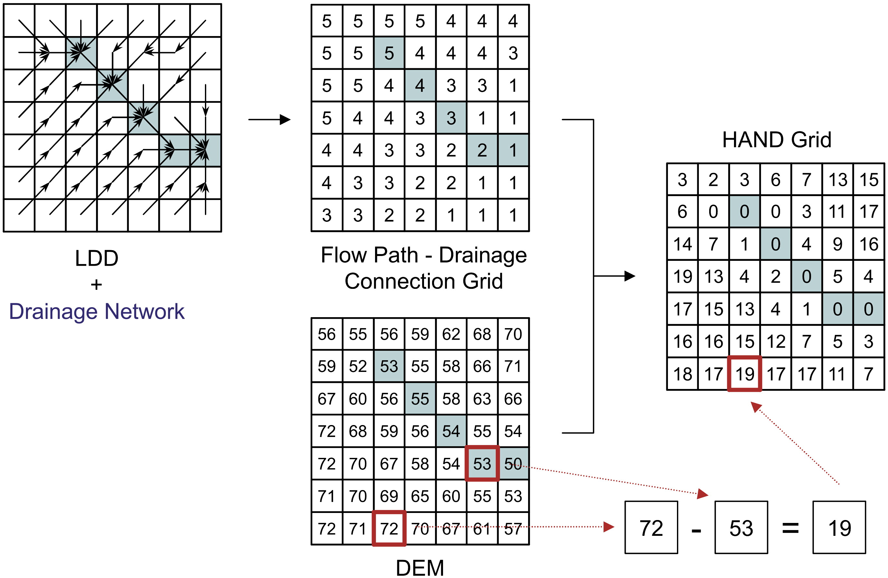

## Basin and Sub-basin Delineation {#Basin-and-Sub-basin-Delineation}

- [minibasins](#minibasins)  
- [outletbasin](#outletbasin)  
- [ottobasins](#ottobasins)  


### minibasins {#minibasins}  
### outletbasin {#outletbasin}  
### ottobasins {#ottobasins}  
 


## Geomorphometric analysis {#Geomorphometric-analysis}

- [tpi](#tpi)  
- [hand](#hand)  
- [sand](#sand)  
- [d8slope](#d8slope)  

### tpi {#tpi}  

`tpi` computes the **Topographic Position Index (TPI)**—the difference between the elevation of a focal cell and the mean elevation of its surrounding neighborhood (excluding the focal cell). Positive TPI values indicate local highs (ridges/crests), negative values indicate local lows (valleys/concavities), and values near zero indicate flats or uniform slopes. TPI is scale-dependent: the neighborhood size (window) controls which landforms are emphasized (Weiss, 2001; Jenness, 2006).

**Method (moving window).**  
For each cell, compute the local mean of neighbors within a user-defined SQUARE or CIRCLE window of given size (in cells), then subtract that mean from the focal elevation. Larger windows capture broader landforms; smaller windows highlight fine-scale features (Weiss, 2001; Jenness, 2006).

**Interpretation.**  
• **TPI » 0** → ridges/peaks/crests  
• **TPI « 0** → valleys/channels/depressions  
• **TPI ≈ 0** → planar or uniformly inclined surfaces

> **Notes**
> • Choose the window size to match the target landform scale; multi-scale analyses often compute TPI at several sizes (Weiss, 2001).
> • The approach popularized by Jenness (2006) operationalized TPI for GIS users and helped standardize classification combining TPI with slope and thresholds (SD-based).
> • TPI is dimensionally consistent with the DEM: results are in the same units (e.g., meters).
> • The dominance formulation in Muñoz & Valeriano (2014) describes the same concept as the vertical difference to a local average surface.
---

**Parameters**

| Flag         | Description                                                                                                   |
|--------------------|-----------------------------------------------------------------------------------------------------------------|
| `dem`        | Input DEM (GeoTIFF) (e.g., *inputDEM.tif*).                                                                      |
| `inputWindowSize`  | Neighborhood window size (in **cells**) used to compute the local mean (scale of analysis).                    |
| `SQUARE|CIRCLE`    | Neighborhood shape: `SQUARE` (square kernel) or `CIRCLE` (circular kernel).                                     |
| `output`     | Output TPI raster (same elevation units as the DEM) (e.g., *outputTPI.tif*).                                     |

The following example demonstrates how to use `tpi` tool from the command line:
```bash
th tpi inputDEM.tif inputWindowSize SQUARE|CIRCLE outputTPI.tif
```

*References*:

Jenness, J. (2006). Topographic Position Index (tpi_jen.avx) extension for ArcView 3.x (Version 1.2). Jenness Enterprises. [http://www.jennessent.com/arcview/tpi.htm](http://www.jennessent.com/arcview/tpi.htm)

Muñoz, V. A., & de Valeriano, M. M. (2014). Mapping of flood-plain by processing of elevation data from remote sensing. In E. Pardo-Igúzquiza, C. Guardiola-Albert, J. Heredia, L. Moreno-Merino, J. Durán, & J. Vargas-Guzmán (Eds.), Mathematics of Planet Earth (Lecture Notes in Earth System Sciences, pp. 543–546). Springer. [https://doi.org/10.1007/978-3-642-32408-6_106](https://doi.org/10.1007/978-3-642-32408-6_106)

Weiss, A. D. (2001, July). Topographic position and landforms analysis (Poster). ESRI International User Conference, San Diego, CA.

*See also*: [hand](#hand).


### hand {#hand}  

`hand` computes the **Height Above the Nearest Drainage (HAND)** (Rennó et al., 2008) for each DEM cell, a terrain descriptor that measures the vertical distance from a cell to its nearest drainage cell along the D8 flow path. By normalizing elevations to the drainage network, HAND highlights local hydrologic gradients (draining potential) and is widely used to delineate valley bottoms, riparian zones, and flood-susceptible areas. 

**Concept (summary).**  
Given a hydrologically conditioned DEM, a D8 flow grid, and a drainage mask, each cell is linked to its downstream drainage cell via the D8 path. The HAND value is the DEM elevation difference between the cell and that drainage cell. Drainage cells have HAND = 0 by definition; upland cells have positive values that reflect their relative height above channels. This relative (network-referenced) height often correlates with soil moisture regime and water-table depth in low-relief landscapes.

> **Prerequisites.** Use a pitless DEM (e.g., `removepits`), its D8 directions (`d8`), and a drainage grid (`d8drainage`). Ensure rasters share the same extent, resolution, and alignment.



**Figure.** HAND map: drainage cells at 0 m (valley bottoms) and increasing HAND values upslope.
**Figure - HAND calculation scheme**. Drainage-network cells are shown as blue squares, and flow path considers exclusively the black-arrow directions (Source: Rennó et al, 2008).

---

**Parameters**

| Flag        | Description                                                                                 |
|-------------------|---------------------------------------------------------------------------------------------|
| `dem`       | Input DEM (GeoTIFF) (e.g., *inputDEM.tif*).                                                  |
| `d8`            | Input D8 flow directions (GeoTIFF) (e.g., *inputD8.tif*).                                    |
| `drainage`      | Input drainage network (GeoTIFF; 1 = stream, 0 = non-stream) (e.g., *inputDrainage.tif*).    |
| `output`    | Output HAND raster (GeoTIFF) (e.g., *outputHAND.tif*).                                       |

> **Notes.**  
> • HAND is relative to the mapped drainage; choosing an appropriate drainage threshold (from d8drainage) affects HAND smoothness and valley width representation.  
> • Small negative differences caused by noise are typically clamped to 0.
> • Derived HAND classes can support terrain zoning (e.g., waterlogged / ecotone / upland) and hydrologic modeling (e.g. classes from highest to lowest susceptibility to flooding).


The following example demonstrates how to use `hand` tool from the command line:
```bash
th hand inputDEM.tif inputD8.tif inputDrainage.tif outputHAND.tif
```
*Reference*:

Rennó, C. D., Nobre, A. D., Cuartas, L. A., Soares, J. V., Hodnett, M. G., Tomasella, J., & Waterloo, M. J. (2008). HAND, a new terrain descriptor using SRTM-DEM: Mapping terra-firme rainforest environments in Amazonia. Remote Sensing of Environment, 112(9), 3469-3481. [https://doi.org/10.1016/j.rse.2008.03.018](https://doi.org/10.1016/j.rse.2008.03.018)

*See also*: [d8](#d8), [d8ca](#d8ca).

### sand {#sand}  
### d8slope {#d8slope}  

